# Systems Engineering Progress Tracker

> Companion to [`SYSTEMS_ENGINEERING_ROADMAP.md`](SYSTEMS_ENGINEERING_ROADMAP.md).
>
> Update this file as the curriculum evolves. Dates and notes matter more than checking boxes quickly.

## Current status

- **Weekly capacity:** 6–8 hours
- **Primary programming background:** Python (data/analytics stack)
- **Mobile device:** Android
- **Mobile strategy:** Termux + downloadable videos + mobile-friendly HTML
- **Current level:** Level 0 — Engineering environment
- **Current milestone:** Not started

---

# Progress overview

```mermaid
flowchart LR
    L0[Level 0 Tooling] --> L1[Level 1 C]
    L1 --> L2[Level 2 Memory / DS]
    L2 --> M1[Milestone 1 Hash Table]
    M1 --> L3[Level 3 Unix / POSIX]
    L3 --> M2[Milestone 2 Editor]
    M2 --> M3[Milestone 3 Shell]
    M3 --> L4[Level 4 Architecture]
    L4 --> M4[Milestone 4 VM / Emulator]
    M4 --> L5[Level 5 Performance]
    L5 --> M5[Milestone 5 Allocator]
    M5 --> L6[Level 6 Networking]
    L6 --> M6[Milestone 6 Concurrent Server]
    M6 --> L7[Level 7 OS / Concurrency]
    L7 --> M7[Milestone 7 Container]
    M7 --> M8[Milestone 8 FUSE]
    M8 --> L8[Level 8 DB Internals]
    L8 --> M9[Milestone 9 Database]
    M9 --> L9[Level 9 Binaries / Debugging]
    L9 --> M10[Milestone 10 Linux Debugger]
```

---

# Level checklist

## Level 0 — Engineering environment

- [ ] Understand terminal vs shell
- [ ] Navigate filesystem confidently from CLI
- [ ] Understand stdin / stdout / stderr
- [ ] Use pipes and redirection
- [ ] Explain source → compiler → object → linker → executable
- [ ] Compile a minimal C program manually
- [ ] Enable compiler warnings
- [ ] Use basic Git workflow
- [ ] Create a basic Makefile
- [ ] Inspect/debug a simple failure
- [ ] Pass Level 0 knowledge check

**Notes:**

- _Add notes here._

---

## Level 1 — C fundamentals

- [ ] Primitive types and `sizeof`
- [ ] Signed / unsigned integers
- [ ] Control flow
- [ ] Functions and scope
- [ ] Arrays
- [ ] C strings
- [ ] `struct`
- [ ] `enum`
- [ ] Headers and translation units
- [ ] Preprocessor basics
- [ ] `argc` / `argv`
- [ ] Basic file I/O
- [ ] Big O / Ω / Θ basics
- [ ] Binary search
- [ ] Elementary sorting
- [ ] Recursion basics
- [ ] Discrete math: logic / sets / functions
- [ ] Discrete math: proof intuition / induction
- [ ] Pass Level 1 knowledge check

**Notes:**

- _Add notes here._

---

## Level 2 — Memory and data structures

- [ ] Addresses and pointers
- [ ] Dereferencing
- [ ] Pointer arithmetic
- [ ] Arrays vs pointers
- [ ] Stack vs heap
- [ ] Object lifetime
- [ ] `malloc`
- [ ] `calloc`
- [ ] `realloc`
- [ ] `free`
- [ ] `NULL`
- [ ] Memory leaks
- [ ] Dangling pointers
- [ ] Double-free / use-after-free concepts
- [ ] Buffer overflow concept
- [ ] Dynamic array
- [ ] Linked list
- [ ] Stack data structure
- [ ] Queue
- [ ] Binary search tree
- [ ] Pass Level 2 knowledge check

**Notes:**

- _Add notes here._

---

# Milestones

## Milestone 1 — Hash Table in C

**Status:** Not started

- [ ] Complete guided implementation
- [ ] Explain hashing and collision handling
- [ ] Explain average vs worst-case complexity
- [ ] Explain load factor
- [ ] Identify every allocation / ownership relationship
- [ ] Complete transfer task
- [ ] Complete engineering review

**Transfer task:** _TBD when milestone starts._

**Engineering review notes:**

- Architecture:
- Correctness:
- Complexity:
- Memory:
- Performance:
- Failure modes:
- Security:
- Testing:
- Trade-offs:

---

## Level 3 — Unix / POSIX and processes

- [ ] Kernel vs user space
- [ ] System calls
- [ ] File descriptors
- [ ] `open/read/write/close`
- [ ] Processes / PID
- [ ] `fork`
- [ ] `exec`
- [ ] `wait`
- [ ] Environment variables
- [ ] Pipes
- [ ] Signals
- [ ] Terminal / TTY basics
- [ ] Pass Level 3 knowledge check

---

## Milestone 2 — Text Editor

**Status:** Not started

- [ ] Guided implementation
- [ ] Transfer task
- [ ] Engineering review

---

## Milestone 3 — Unix Shell

**Status:** Not started

- [ ] Guided implementation
- [ ] Explain process lifecycle
- [ ] Explain `fork` / `exec` / `wait`
- [ ] Explain file descriptor behavior
- [ ] Transfer task
- [ ] Engineering review

---

## Level 4 — Computer architecture

- [ ] Binary / hexadecimal
- [ ] Bitwise operations
- [ ] Integer representation
- [ ] Endianness
- [ ] Registers
- [ ] Machine instructions
- [ ] Program counter / instruction pointer
- [ ] Stack pointer
- [ ] Calls and returns
- [ ] Stack frames
- [ ] Calling conventions
- [ ] Nand2Tetris Project 1
- [ ] Nand2Tetris Project 2
- [ ] Nand2Tetris Project 3
- [ ] Nand2Tetris Project 4
- [ ] Nand2Tetris Project 5
- [ ] Nand2Tetris Project 6
- [ ] Pass Level 4 knowledge check

---

## Milestone 4 — VM / Emulator

**Chosen project:** _TBD_

- [ ] Guided implementation
- [ ] Explain fetch → decode → execute
- [ ] Transfer task
- [ ] Engineering review

---

## Level 5 — Performance and memory hierarchy

- [ ] Registers / cache / RAM hierarchy
- [ ] Cache lines
- [ ] Temporal locality
- [ ] Spatial locality
- [ ] Cache hits / misses
- [ ] Contiguous memory
- [ ] Connect concepts to NumPy / array layout
- [ ] Pass Level 5 knowledge check

---

## Milestone 5 — Memory Allocator

- [ ] Guided implementation
- [ ] Explain allocator metadata
- [ ] Explain fragmentation
- [ ] Explain free-list strategy
- [ ] Transfer task
- [ ] Engineering review

---

## Level 6 — Networking

- [ ] Ethernet
- [ ] MAC
- [ ] ARP
- [ ] IPv4
- [ ] Subnetting
- [ ] Routing
- [ ] ICMP
- [ ] UDP
- [ ] TCP
- [ ] Ports
- [ ] DNS basics
- [ ] Socket API
- [ ] Byte order
- [ ] TCP echo server/client
- [ ] Minimal HTTP-like server
- [ ] Multi-client server
- [ ] MIT 6.006 selections as needed
- [ ] Pass Level 6 knowledge check

---

## Milestone 6 — Concurrent Server

- [ ] Guided implementation
- [ ] Compare blocking, threaded, and event-driven designs
- [ ] Transfer task
- [ ] Engineering review

---

## Level 7 — Operating systems and concurrency

- [ ] Processes vs threads
- [ ] Context switching
- [ ] Scheduling
- [ ] Virtual memory
- [ ] Pages / page tables
- [ ] TLB
- [ ] IPC
- [ ] Race conditions
- [ ] Mutexes
- [ ] Semaphores
- [ ] Condition variables
- [ ] Deadlocks
- [ ] Filesystem concepts
- [ ] Devices / I/O
- [ ] Pass Level 7 knowledge check

---

## Milestone 7 — Linux Container

- [ ] Guided implementation
- [ ] Explain namespaces / isolation
- [ ] Transfer task
- [ ] Engineering review

---

## Milestone 8 — FUSE Filesystem

- [ ] Guided implementation
- [ ] Explain core filesystem abstractions
- [ ] Transfer task
- [ ] Engineering review

---

## Level 8 — Database internals

- [ ] Storage characteristics
- [ ] Pages
- [ ] Records
- [ ] Serialization
- [ ] B-trees
- [ ] Indexes
- [ ] Buffer/cache concepts
- [ ] Query execution basics
- [ ] Transactions conceptually
- [ ] WAL conceptually
- [ ] Pass Level 8 knowledge check

---

## Milestone 9 — Simple Database

- [ ] Guided implementation
- [ ] Explain parser → execution → B-tree → page → storage path
- [ ] Transfer task
- [ ] Engineering review

---

## Level 9 — Binaries / debugging / security bridge

- [ ] ELF basics
- [ ] Sections / symbols
- [ ] Debug information
- [ ] Breakpoints
- [ ] Signals
- [ ] Stack frames
- [ ] Calling conventions deeper
- [ ] Process memory
- [ ] Memory-corruption concepts
- [ ] Pass Level 9 knowledge check

---

## Milestone 10 — Linux Debugger

- [ ] Breakpoints
- [ ] Registers and memory
- [ ] ELF / DWARF
- [ ] Signals
- [ ] Source-level stepping
- [ ] Stack unwinding
- [ ] Variables
- [ ] Transfer task
- [ ] Engineering review

---

# Advanced-track backlog

These are not part of the finite core. Promote them when goals justify it.

## Security / reverse engineering

- [ ] Ghidra
- [ ] x86-64 deeper
- [ ] ELF deeper
- [ ] Reverse engineering
- [ ] Memory corruption / exploitation fundamentals
- [ ] OS security

## Distributed systems / architecture

- [ ] Replication
- [ ] Partitioning
- [ ] Consistency models
- [ ] Consensus
- [ ] Failure detection
- [ ] Queues
- [ ] Distributed storage
- [ ] Reliability
- [ ] Observability
- [ ] System design case studies

## Kernel / OS

- [ ] Bootloader
- [ ] Kernel fundamentals
- [ ] Interrupts
- [ ] Scheduler
- [ ] Memory manager
- [ ] Drivers

## Compilers / runtimes

- [ ] Lexer
- [ ] Parser
- [ ] AST
- [ ] Bytecode
- [ ] VM deeper
- [ ] Code generation
- [ ] Garbage collection
- [ ] Crafting Interpreters milestone
- [ ] C compiler milestone

## Performance

- [ ] Profiling deeper
- [ ] SIMD basics
- [ ] Parallelism
- [ ] Synchronization overhead
- [ ] High-performance matrix multiplication milestone

## Embedded

- [ ] Microcontroller basics
- [ ] GPIO
- [ ] Interrupts
- [ ] UART
- [ ] SPI
- [ ] I²C
- [ ] RTOS fundamentals

## Rust

- [ ] Ownership
- [ ] Borrowing
- [ ] Lifetimes
- [ ] Reimplement one C milestone in Rust
- [ ] Compare memory model and failure modes with C

---

# Learning log

Use this table for meaningful changes, not every study session.

| Date | Change / finding | Why it matters | Roadmap adjustment |
|---|---|---|---|
| 2026-08-15 | Initial roadmap created | Need a durable systems-engineering track instead of a chat-only plan | Core levels, milestones, mobile strategy, and advanced tracks recorded |

---

# Current next action

**Level 0, Lesson 1:** understand the path from C source code to a running process and set up a minimal C toolchain on PC + Android/Termux.
