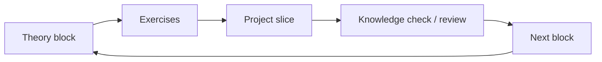

# Systems Engineering Progress Tracker

> Companion to [`SYSTEMS_ENGINEERING_ROADMAP.md`](SYSTEMS_ENGINEERING_ROADMAP.md).
>
> Track both **knowledge** and **project growth**. A topic is not considered integrated until it has been used in exercises and, where applicable, in a real milestone slice.

## Current status

- **Weekly capacity:** 6–8 hours
- **Primary programming background:** Python (data/analytics stack)
- **Mobile device:** Android
- **Mobile strategy:** Termux + downloadable videos + mobile-friendly HTML
- **Current phase:** Phase 0 — Minimal engineering environment
- **Current milestone:** Milestone 1 — Hash Table in C (scaffold not started)
- **Learning rule:** theory -> exercise -> milestone slice -> next theory -> exercise -> next milestone slice

---

# Progress model



For each phase, track:

1. **Theory understood**
2. **Exercises completed independently**
3. **Relevant milestone slice implemented**
4. **Concept explained back without notes**
5. **Engineering implications discussed**

---

# Core CS threads

These threads are mandatory parts of the finite core.

## C / Software Construction

- [ ] Types / representation
- [ ] Arrays / strings
- [ ] Structs / modules
- [ ] Pointers
- [ ] Dynamic memory / ownership
- [ ] Error handling
- [ ] Build/link model
- [ ] Debugging/testing
- [ ] POSIX/system APIs

## Algorithms & Data Structures

- [ ] Complexity intuition
- [ ] Linear / binary search
- [ ] Elementary sorting
- [ ] Dynamic arrays
- [ ] Linked lists
- [ ] Stacks / queues
- [ ] Hash tables
- [ ] Trees / heaps
- [ ] Graphs / BFS / DFS
- [ ] Shortest paths
- [ ] Dynamic programming fundamentals

## Discrete Math / Reasoning

Learn just in time:

- [ ] Functions / growth rates
- [ ] Logarithms
- [ ] Sums
- [ ] Logic
- [ ] Sets / relations
- [ ] Invariants
- [ ] Induction
- [ ] Modular arithmetic
- [ ] Probability intuition
- [ ] Recurrence intuition
- [ ] Graph terminology

## Computer Architecture

- [ ] Binary / hexadecimal
- [ ] Integer representation
- [ ] Logic gates / Boolean arithmetic
- [ ] ALU
- [ ] Registers / memory
- [ ] CPU / instruction cycle
- [ ] Machine language
- [ ] Assembly
- [ ] Stack frames / ABI
- [ ] Cache / memory hierarchy

## Operating Systems / Concurrency

- [ ] Syscalls / user vs kernel
- [ ] Processes / threads
- [ ] Scheduling / context switching
- [ ] Virtual memory / paging / TLB
- [ ] IPC
- [ ] Synchronization
- [ ] Races / deadlocks
- [ ] Devices / I/O
- [ ] Filesystems
- [ ] Isolation

## Networking

- [ ] Ethernet / MAC
- [ ] ARP
- [ ] IP / subnetting / routing
- [ ] ICMP
- [ ] UDP
- [ ] TCP
- [ ] DNS basics
- [ ] Socket API
- [ ] Concurrent network services

## Storage / Database Internals

- [ ] Storage-cost intuition
- [ ] Pages / records
- [ ] Serialization
- [ ] B-trees / indexes
- [ ] Buffer/cache
- [ ] Query execution basics
- [ ] Transactions
- [ ] WAL / recovery concepts

## Binaries / Debugging / Security Bridge

- [ ] ELF / executable structure
- [ ] Symbols / debug info
- [ ] Registers / stack frames
- [ ] Breakpoints / signals
- [ ] Process memory
- [ ] Memory corruption concepts
- [ ] Reverse-engineering bridge

## System Design / Architecture Thinking

Repeated after every milestone:

- [ ] Component boundaries
- [ ] State / ownership
- [ ] Complexity / resource cost
- [ ] Failure modes
- [ ] Stable interfaces
- [ ] Testing / observability
- [ ] Security considerations
- [ ] 10x-scale thought experiment
- [ ] Trade-offs documented

---

# Phase 0 — Minimal engineering environment

## Cycle 0.1

### Theory

- [ ] Terminal vs shell
- [ ] Current directory / paths
- [ ] `cd`, `ls`, `mkdir`
- [ ] Source file vs executable
- [ ] Compiler role
- [ ] Run a compiled program
- [ ] Exit code

### Exercises

- [ ] Compile a minimal C program manually
- [ ] Run it from the terminal
- [ ] Change it, rebuild it, rerun it
- [ ] Trigger/read a simple compiler diagnostic

### Project slice — Hash Table scaffold

- [ ] Create project workspace
- [ ] Create placeholder source/header/test structure
- [ ] Compile a smoke-test executable

### Gate

- [ ] Explain `source -> compiler -> executable -> process`

---

# Phase 1 — C fundamentals

## Cycle 1.1 — Types and representation

### Theory

- [ ] Primitive types
- [ ] `sizeof`
- [ ] Signed / unsigned
- [ ] Integer range / overflow intuition
- [ ] Scope basics

### Exercises

- [ ] Inspect type sizes
- [ ] Compare C integer behavior with Python
- [ ] Write small numeric functions

### Hash Table slice

- [ ] Sketch public API
- [ ] Create fixed-capacity placeholder storage
- [ ] Add smoke test

---

## Cycle 1.2 — Control flow / functions

### Theory

- [ ] Control flow fast pass
- [ ] Functions
- [ ] Declarations vs definitions
- [ ] Return/error conventions basics

### Exercises

- [ ] Small functions
- [ ] Input validation / return codes

### Hash Table slice

- [ ] Basic create/get-style stubs
- [ ] Define initial error conventions

---

## Cycle 1.3 — Arrays / strings + Algorithms I

### Theory

- [ ] Fixed arrays
- [ ] `char` arrays
- [ ] C strings / null terminator
- [ ] Bounds responsibility

### Algorithms

- [ ] Linear search
- [ ] Binary search
- [ ] Elementary sorting
- [ ] Big-O intuition

### Math just-in-time

- [ ] Functions / growth
- [ ] Logarithm intuition
- [ ] Simple loop-cost sums

### Exercises

- [ ] Search fixed arrays
- [ ] Sort fixed arrays
- [ ] Write basic string operations

### Hash Table slice

- [ ] Fixed-capacity key/value entries
- [ ] Linear key lookup

---

## Cycle 1.4 — Structs / modules

### Theory

- [ ] `struct`
- [ ] `enum`
- [ ] `.h` / `.c`
- [ ] Translation units
- [ ] Preprocessor basics
- [ ] Linker introduced here

### Exercises

- [ ] Model records with structs
- [ ] Split small program across files

### Hash Table slice

- [ ] Explicit entry/table structs
- [ ] Public interface separated from implementation

### Phase gate

- [ ] Explain core Python-vs-C differences encountered so far

---

# Phase 2A — Representation and pointers

## Cycle 2A.1

- [ ] Understand byte / address
- [ ] `&` / `*`
- [ ] Pointer types
- [ ] Dereference
- [ ] `NULL`
- [ ] Exercise: value vs pointer parameters
- [ ] Hash Table: functions operate on table pointers
- [ ] Explain every current pointer target/lifetime

## Cycle 2A.2

- [ ] Arrays vs pointers
- [ ] Pointer arithmetic
- [ ] Strings via pointers
- [ ] Pointer-to-struct syntax
- [ ] Exercises with indexed vs pointer traversal
- [ ] Hash Table: pointer-based entry traversal

---

# Phase 2B — Dynamic memory and ownership

## Cycle 2B.1 — stack / lifetime

- [ ] Stack lifetime concept
- [ ] Safe/unsafe returned pointers
- [ ] Dangling-pointer concept
- [ ] Lifetime exercises
- [ ] Hash Table: ownership rules documented

## Cycle 2B.2 — heap

- [ ] `malloc`
- [ ] `calloc`
- [ ] `realloc`
- [ ] `free`
- [ ] Allocation failure
- [ ] Exercise: allocate/free arrays/structs
- [ ] Exercise: grow allocation
- [ ] Hash Table: dynamic table/entry allocation
- [ ] Hash Table: cleanup/destructor path

## Cycle 2B.3 — failure modes

- [ ] Memory leaks
- [ ] Double free
- [ ] Use-after-free concept
- [ ] Buffer overflow concept
- [ ] Compiler warnings / sanitizer / debugger intro
- [ ] Diagnose intentional memory bugs
- [ ] Hash Table: cleanup/error-path tests

---

# Phase 2C — Core DS / algorithms

## Cycle 2C.1 — Dynamic Array mini-milestone

- [ ] Size vs capacity
- [ ] Geometric growth
- [ ] Amortized-growth intuition
- [ ] Build Vector: create/free
- [ ] Build Vector: get/set
- [ ] Build Vector: push
- [ ] Build Vector: resize
- [ ] Engineering comparison: vector vs fixed array

## Cycle 2C.2 — Linked structures

- [ ] Linked list
- [ ] Stack
- [ ] Queue
- [ ] Node ownership
- [ ] Implement small linked list
- [ ] Implement stack/queue
- [ ] Compare contiguous vs linked representation

## Cycle 2C.3 — Hashing

- [ ] Hash function role
- [ ] Buckets
- [ ] Collision concept
- [ ] Chaining/open-addressing concept
- [ ] Load factor
- [ ] Average vs worst-case complexity
- [ ] Modular arithmetic basics
- [ ] Probability intuition
- [ ] Hash Table: hash -> bucket
- [ ] Hash Table: collision handling

## Cycle 2C.4 — Resizing

- [ ] Load-factor threshold
- [ ] Rehashing
- [ ] Amortized resize cost
- [ ] Hash Table: automatic resize
- [ ] Hash Table: rehash entries
- [ ] Add tests/statistics

---

# Milestone 1 — Hash Table in C

**Status:** Not started

- [ ] All incremental slices completed
- [ ] Guided tutorial/project completed with understanding
- [ ] Transfer task selected
- [ ] Transfer task implemented independently
- [ ] Explain representation / ownership
- [ ] Explain average / worst-case complexity
- [ ] Explain load factor / resize
- [ ] Review failure paths / memory
- [ ] Review API/design trade-offs
- [ ] Testing review
- [ ] Security review
- [ ] 10x/100x scale thought experiment

**Transfer task:** _TBD when milestone nears completion._

**Engineering review notes:**

- Architecture:
- Correctness:
- Complexity:
- Memory:
- Performance:
- Failure modes:
- Security:
- Testing:
- Trade-offs:
- Scale:

---

# Phase 3 — Unix / POSIX

Theory and projects are interleaved.

## CS topics

- [ ] Kernel vs user space
- [ ] Syscall concept
- [ ] File descriptors
- [ ] `open/read/write/close`
- [ ] Process / PID
- [ ] `fork`
- [ ] `exec`
- [ ] `wait`
- [ ] Environment
- [ ] Pipes / redirection
- [ ] Signals
- [ ] Terminal / TTY

## Milestone 2 — Text Editor slices

- [ ] Terminal I/O
- [ ] Raw mode
- [ ] Editable buffer
- [ ] Load/save
- [ ] Cursor/status
- [ ] Transfer feature
- [ ] Engineering review

## Milestone 3 — Unix Shell slices

- [ ] Parser
- [ ] Launch one command
- [ ] `fork/exec/wait`
- [ ] Built-in `cd`
- [ ] Redirection
- [ ] Pipeline
- [ ] Transfer feature
- [ ] Engineering review

---

# Phase 4 — Computer architecture / assembly

## CS topics

- [ ] Binary / hexadecimal
- [ ] Bitwise operations
- [ ] Signed representation
- [ ] Endianness
- [ ] Boolean logic
- [ ] ALU
- [ ] Registers / memory
- [ ] CPU instruction cycle
- [ ] Machine code
- [ ] Assembly basics
- [ ] PC/IP / stack pointer
- [ ] Calls / returns / stack frames
- [ ] Calling convention / ABI

## Nand2Tetris

- [ ] Project 1 — Boolean Logic
- [ ] Project 2 — Boolean Arithmetic
- [ ] Project 3 — Memory
- [ ] Project 4 — Machine Language
- [ ] Project 5 — Computer Architecture
- [ ] Project 6 — Assembler

## Milestone 4 — VM / Emulator slices

- [ ] Machine-state representation
- [ ] Registers / PC
- [ ] Decode instructions
- [ ] Arithmetic/load/store
- [ ] Control flow
- [ ] I/O
- [ ] Transfer/debug feature
- [ ] Engineering review

---

# Phase 5 — Performance / memory hierarchy

- [ ] Registers / cache / RAM hierarchy
- [ ] Cache lines
- [ ] Temporal locality
- [ ] Spatial locality
- [ ] Cache hits/misses
- [ ] Contiguous vs scattered memory
- [ ] Branch behavior basics
- [ ] Profiling basics
- [ ] Connect to NumPy / array layout

## Milestone 5 — Memory Allocator slices

- [ ] Linear/bump allocation concept
- [ ] Block metadata
- [ ] Free list
- [ ] Reuse blocks
- [ ] Split/coalesce
- [ ] Fragmentation statistics
- [ ] Transfer allocation policy comparison
- [ ] Engineering review

---

# Phase 6 — Networking / servers

## Networking CS

- [ ] Ethernet / frames
- [ ] MAC
- [ ] ARP
- [ ] IPv4 / subnetting
- [ ] Routing
- [ ] ICMP
- [ ] UDP
- [ ] TCP
- [ ] Ports
- [ ] DNS basics
- [ ] Byte order
- [ ] Socket API

## Project growth

- [ ] TCP echo client/server
- [ ] Simple application protocol
- [ ] Minimal HTTP-like server
- [ ] Multi-client server

## Concurrency begins

- [ ] Blocking vs non-blocking
- [ ] Thread concept
- [ ] Event-driven I/O
- [ ] Event loop

## Milestone 6 — Concurrent Server

- [ ] Build threaded/blocking version
- [ ] Build or study event-driven version
- [ ] Compare designs
- [ ] Transfer task
- [ ] Engineering review

## MIT 6.006 deeper selections

- [ ] Balanced trees / heaps as needed
- [ ] BFS / DFS
- [ ] Shortest paths
- [ ] Dynamic programming fundamentals

---

# Phase 7 — Operating systems / concurrency

- [ ] Process vs thread
- [ ] Context switch
- [ ] Scheduling
- [ ] Virtual memory
- [ ] Pages / page tables
- [ ] TLB
- [ ] IPC
- [ ] Race conditions
- [ ] Mutexes
- [ ] Semaphores
- [ ] Condition variables
- [ ] Deadlocks
- [ ] Devices / I/O
- [ ] Filesystem concepts

## Milestone 7 — Linux Container slices

- [ ] Process creation
- [ ] Namespaces
- [ ] Mount/filesystem isolation
- [ ] Isolation/resource model
- [ ] Transfer feature
- [ ] Engineering review

## Milestone 8 — FUSE Filesystem slices

- [ ] Filesystem interface
- [ ] Path lookup
- [ ] Metadata
- [ ] File operations
- [ ] Persistence behavior
- [ ] Transfer feature
- [ ] Engineering review

---

# Phase 8 — Storage / database internals

- [ ] Storage-cost intuition
- [ ] Pages
- [ ] Records
- [ ] Serialization
- [ ] B-trees
- [ ] Indexes
- [ ] Buffer/cache
- [ ] Query execution basics
- [ ] Transactions
- [ ] WAL/recovery

## Milestone 9 — Simple Database slices

- [ ] REPL / parsing
- [ ] Row serialization
- [ ] Page representation
- [ ] Table scan
- [ ] B-tree/index
- [ ] Page splitting
- [ ] Persistence
- [ ] Transfer: instrumentation/secondary index/etc.
- [ ] Engineering review

---

# Phase 9 — Binaries / debugging / security bridge

- [ ] ELF basics
- [ ] Sections / symbols
- [ ] Debug information
- [ ] Registers
- [ ] Stack frames / ABI deeper
- [ ] Breakpoints
- [ ] Signals
- [ ] Process memory
- [ ] Memory-corruption concepts

## Milestone 10 — Linux Debugger slices

- [ ] Process control
- [ ] Breakpoints
- [ ] Registers/memory
- [ ] ELF/DWARF
- [ ] Stepping
- [ ] Source-level breakpoints
- [ ] Stack unwinding
- [ ] Variables
- [ ] Transfer task
- [ ] Engineering review

---

# Advanced-track backlog

Not part of the finite core; promote when goals justify it.

## Security / Reverse Engineering

- [ ] x86-64 deeper
- [ ] ELF deeper
- [ ] Ghidra
- [ ] Reverse engineering
- [ ] Memory corruption / exploitation fundamentals
- [ ] OS security

## Distributed Systems / Architecture

- [ ] Replication
- [ ] Partitioning / sharding
- [ ] Consistency models
- [ ] Consensus
- [ ] Failure detection
- [ ] Retries / idempotency
- [ ] Queues / streams
- [ ] Distributed storage
- [ ] Caching
- [ ] Observability
- [ ] Reliability / SLOs
- [ ] Capacity / bottleneck reasoning
- [ ] System-design case studies
- [ ] Build a running distributed-system project incrementally

## Kernel / OS

- [ ] Bootloader
- [ ] Interrupts
- [ ] Scheduler
- [ ] Memory manager
- [ ] Filesystems
- [ ] Drivers

## Compilers / Runtimes

- [ ] Lexer
- [ ] Parser
- [ ] AST
- [ ] Bytecode
- [ ] VM deeper
- [ ] Code generation
- [ ] Garbage collection
- [ ] Crafting Interpreters milestone
- [ ] C compiler milestone

## Performance Engineering

- [ ] Profiling deeper
- [ ] SIMD fundamentals
- [ ] Parallelism
- [ ] Synchronization overhead
- [ ] High-performance matrix multiplication milestone

## Embedded / Hardware

- [ ] Microcontrollers
- [ ] GPIO
- [ ] Interrupts
- [ ] UART
- [ ] SPI
- [ ] I²C
- [ ] RTOS fundamentals

## Rust

- [ ] Ownership
- [ ] Borrowing
- [ ] Lifetimes
- [ ] Reimplement one earlier C milestone
- [ ] Compare memory model / failure modes / ergonomics

---

# AI learning rule

- [ ] AI used primarily as tutor/reviewer/debugging guide
- [ ] Milestone code remains learner-written
- [ ] Debugging escalates from hypothesis -> diagnostic -> hint before solution
- [ ] Transfer tasks completed without AI generating the tested feature

---

# Learning log

| Date | Change / finding | Why it matters | Roadmap adjustment |
|---|---|---|---|
| 2026-08-15 | Initial roadmap created | Need durable systems-engineering track | Core levels and milestones recorded |
| 2026-08-15 | Switched from theory-first to incremental project learning | Isolated exercises do not provide enough real-development practice | Every theory block now feeds exercises and a live milestone project slice; CS threads made explicit core requirements |

---

# Current next action

**First cycle:**

```text
compiler / executable / process basics
-> compile tiny C program
-> learn primitive types and sizeof
-> exercises
-> create first Hash Table scaffold
-> continue C theory
```
