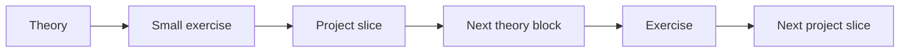
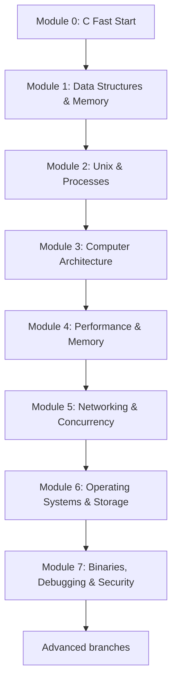

# Systems Engineering Roadmap

> High-level map of the learning direction for this fork.
>
> **The canonical course is now [`course/README.md`](course/README.md).**
>
> This file intentionally stays concise. The course file defines the actual order of study, lesson format, primary sources, project sequence, and module exit criteria.

---

# Goal

Move from an existing Python/data background toward strong systems-engineering and computer-science fundamentals:

- C and explicit memory
- algorithms and data structures
- computer architecture
- Unix / processes
- operating systems and concurrency
- networking
- performance / memory hierarchy
- storage / database internals
- binaries / debugging / security
- system-design / architecture reasoning

Pace: **6–8 hours/week**.

Learning mode: **mobile-first theory + PC-first project implementation**.

---

# Course philosophy

Do not separate theory and projects into long independent phases.

Use the loop:

The project should create the reason to learn the next concept.

---

# Core course map

The detailed syllabus for these modules lives in [`course/README.md`](course/README.md).

---

# Main milestone projects

The original `project-based-learning` repository is treated as a **project catalog**. The course selects milestones from it and uses them as integration projects.

## Early core

1. **Hash Table in C**
2. **Dynamic Array / Vector in C** — custom mini-project
3. **Build Your Own Text Editor**
4. **Write a Shell in C**

## Architecture / performance

5. **Nand2Tetris Projects 1–6**
6. **VM or CHIP-8 Emulator**
7. **Memory Allocator**

## Networking / OS / storage

8. **Concurrent Server**
9. **Linux Container**
10. **FUSE Filesystem**
11. **Simple Database**

## Binary / security bridge

12. **Linux Debugger**

Each project is built incrementally while its supporting theory is being learned.

---

# Where the CS fundamentals live

The course still includes the full CS foundation, but not as disconnected parallel semesters.

| CS topic | Main course location |
|---|---|
| Algorithms / complexity | Modules 1 and 5, then just-in-time |
| Data structures | Module 1 |
| Discrete math | just-in-time inside algorithms/hashing/graphs/correctness |
| Computer architecture | Module 3 |
| Operating systems | Modules 2 and 6 |
| Concurrency | Modules 5 and 6 |
| Networking | Module 5 |
| Storage / DB internals | Module 6 |
| Binaries / debugging | Module 7 |
| System design / architecture thinking | engineering review after every milestone |

---

# Source policy

Avoid learning from many sources simultaneously.

Default rule:

1. **one primary source** for the current module;
2. **one optional reference / Russian companion**;
3. **one active project**.

Russian alternatives and their roles are tracked separately in [`SYSTEMS_ENGINEERING_RUSSIAN_RESOURCES.md`](SYSTEMS_ENGINEERING_RUSSIAN_RESOURCES.md).

---

# Advanced branches

After the core, choose based on goals rather than following one linear curriculum:

- Security / Reverse Engineering
- Distributed Systems / Architecture
- Kernel / OS
- Compilers / Language Runtimes
- Performance Engineering
- Embedded / Hardware
- Rust

---

# Progress tracking

Use [`SYSTEMS_ENGINEERING_PROGRESS.md`](SYSTEMS_ENGINEERING_PROGRESS.md) for the current module, completed concepts, project slices, transfer tasks, and engineering reviews.

---

# Next action

Start with [`course/README.md`](course/README.md) → **Module 0 — C Fast Start**.
