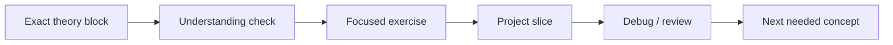
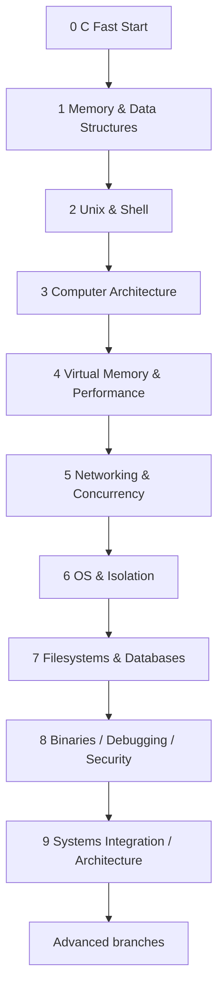

# Systems Engineering Roadmap

> High-level map of the learning direction for this fork.
>
> **The canonical executable course is [`course/README.md`](course/README.md).**
>
> This file intentionally stays short. Detailed prerequisites, lesson order, sources, exercises, project slices, rubrics and exit gates live under `course/`.

---

# Goal

Build a strong systems-engineering and CS foundation from an existing Python background:

- C and explicit memory;
- algorithms and data structures;
- computer architecture and assembly;
- Unix / processes;
- virtual memory and performance;
- networking and concurrency;
- operating systems and isolation;
- filesystems and database internals;
- binaries / debugging / security;
- system integration / architecture reasoning.

**Pace:** 6–8 hours/week.  
**Mode:** mobile-first theory + PC-first implementation.  
**Expected finite core:** roughly 15–20 months including consolidation buffers.

---

# Learning philosophy

Do not finish several theory courses before starting real code.

Do not treat every project tutorial as a modern implementation specification.

---

# Audited core map

---

# Project roles

The upstream `project-based-learning` repository is a **catalog of learning assets**, not the syllabus itself.

## Core milestones

Required integration projects:

1. MiniKV → **Hash Table in C**
2. **Unix Shell**
3. **small VM / Emulator** + Nand2Tetris 1–6
4. **Arena Allocator**
5. **Concurrent KV Server**
6. **modern Linux isolation / mini-container lab**
7. **Simple Database**
8. **Minimal Linux Debugger in C**
9. **Systems Architecture Capstone**

## Guided labs

Useful, but intentionally partial:

- selected Kilo terminal/raw-mode work;
- current libfuse 3 `hello`/`passthrough` adaptation;
- tool/inspection experiments.

## Historical / stretch references

These may still teach valuable ideas but are not copied as-is:

- full Kilo editor;
- `Memory Allocators 101` `sbrk()` backend;
- old `Linux Container in 500 Lines of Code` environment/cgroup assumptions;
- older FUSE 2.x tutorial;
- full Sy Brand C++/libelfin debugger series.

See [`course/AUDIT_2026-08.md`](course/AUDIT_2026-08.md) for rationale.

---

# CS coverage

| Area | Main modules |
|---|---|
| C / software construction | 0–2 |
| Algorithms / data structures | 1 and 5 |
| Discrete math / reasoning | just-in-time in 1, 3, 5, 9 |
| Computer architecture / ABI | 3 |
| Virtual memory / cache / performance | 4 and 6 |
| Unix / processes | 2 |
| Networking | 5 |
| Concurrency | 5–6 |
| Operating systems / isolation | 6 |
| Filesystems / storage | 7 |
| Database internals | 7 |
| Binaries / debugger / security | 8 |
| Architecture / operability | every milestone review + 9 |

---

# Source policy

Normally use only:

1. **one teaching source**;
2. **one optional reference/companion**;
3. the active project specification.

Source roles are explicit: `PRIMARY`, `REFERENCE`, `EXERCISES`, `GUIDED LAB`, `HISTORICAL REFERENCE`.

Russian alternatives are tracked in [`SYSTEMS_ENGINEERING_RUSSIAN_RESOURCES.md`](SYSTEMS_ENGINEERING_RUSSIAN_RESOURCES.md).

---

# Advanced branches

After the finite core:

- Security / Reverse Engineering
- Distributed Systems / Architecture
- Kernel / OS
- Compilers / Language Runtimes
- Performance Engineering
- Embedded / Hardware
- Rust

---

# Progress

Use [`SYSTEMS_ENGINEERING_PROGRESS.md`](SYSTEMS_ENGINEERING_PROGRESS.md).

Start at [`course/00-c-fast-start/README.md`](course/00-c-fast-start/README.md).