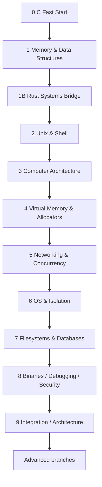

# Systems Engineering Roadmap

Краткая карта. **Исполняемый курс находится в [`course/README.md`](course/README.md).**

## Цель

Получить цельную инженерную модель:

```text
source code
→ data structures / algorithms
→ memory / ownership
→ compiler / ABI / machine code
→ process / OS
→ network / concurrency
→ storage / database
→ binary / debugger / security
→ integrated service / architecture
```

Темп: **6–8 часов в неделю**.

## Core path



Текстовая версия той же цепочки находится выше/в `course/README.md`, поэтому Mermaid не обязателен для mobile navigation.

## Почему Rust стоит после C memory

Сначала вручную изучаются pointers, lifetime, ownership, `malloc/free`, UB и Hash Table. Затем Rust показывает, какие из этих контрактов compiler может проверять через ownership, borrowing, lifetimes, `Result`, safe abstractions и `unsafe` boundaries.

Rust не дублирует каждый C-project.

## Core projects

- MiniKV v0;
- Vector in C;
- Hash Table in C;
- Rust MiniKV bridge;
- Unix Shell;
- Tiny16 assembler + emulator;
- Arena Allocator;
- Concurrent KV Server;
- Modern Linux Isolation Lab;
- SimpleDB;
- `minidbg-c`;
- Persistent KV Service capstone.

## CS fundamentals

Алгоритмы/математика встроены в моменты, где они нужны:

- linear/binary search, Big-O/Ω/Θ, recursion;
- vector amortized growth;
- BST/heap/DP fundamentals;
- hashing/modular arithmetic/probability intuition;
- graphs/BFS/DFS/Dijkstra;
- Boolean logic/CPU/ISA;
- scheduling/queueing/Little's Law;
- B+tree/fan-out/storage cost.

## Source policy

Обязательная теория находится в репозитории. Внешние материалы — только:

- optional deep dive;
- текущая API/standard документация;
- альтернативное объяснение;
- дополнительный проект.

Недоступность внешнего курса не должна блокировать core path.

## Advanced branches

После core выбирается направление:

- Security / Reverse Engineering / Binary Exploitation labs;
- Distributed Systems / Architecture;
- Kernel / OS;
- Rust Systems deeper;
- Compilers / Language Runtimes;
- Performance Engineering;
- Embedded / Hardware.

## Прогресс

[`SYSTEMS_ENGINEERING_PROGRESS.md`](SYSTEMS_ENGINEERING_PROGRESS.md)
