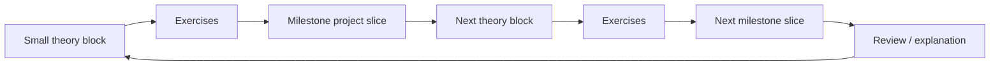
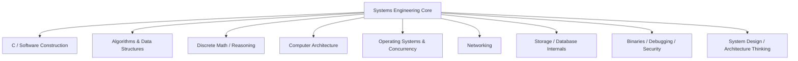
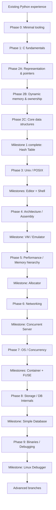
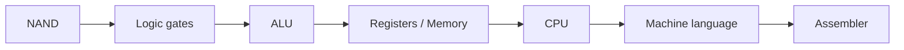
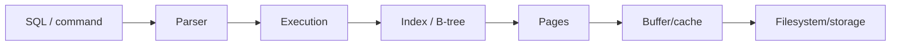
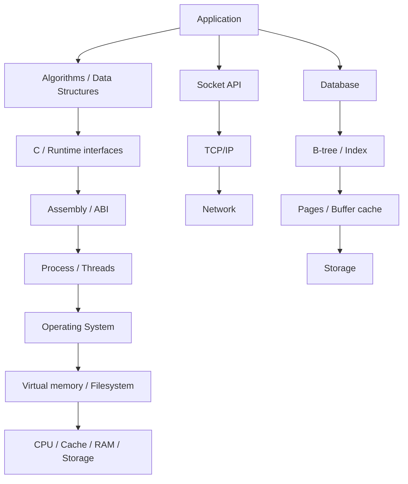

# Systems Engineering Roadmap

> Personal learning track built around the project milestones from this repository.
>
> **Goal:** move from Python/data work toward strong computer-science and systems-engineering fundamentals: C, algorithms, data structures, discrete mathematics, computer architecture, Unix/POSIX, networking, operating systems, concurrency, databases/storage, binaries/debugging, security, distributed systems, and system architecture.
>
> **Current pace:** 6–8 hours/week.
>
> **Learning mode:** mobile-first theory on Android + PC-first implementation. Project tutorials are not rewards at the end of theory; they are long-running integration projects that grow together with the theory.

---

# 1. Fundamental learning rule

The whole roadmap follows one invariant:



**Do not do this:**

```text
8 weeks theory -> many isolated exercises -> finally start a project
```

**Do this instead:**

```text
theory -> exercise -> real project slice -> theory -> exercise -> next project slice
```

Exercises verify one concept. The milestone verifies whether several concepts can be combined into real software.

A milestone may therefore stay **in progress for multiple levels**.

## Milestone completion criteria

A milestone is complete only when all four conditions are met:

1. **Understanding** — explain the important concepts without copying definitions.
2. **Implementation** — build the guided project and understand the code being written.
3. **Transfer** — add a feature/change not present in the tutorial.
4. **Engineering review** — reason about correctness, complexity, memory, performance, failure modes, security, testing, and trade-offs.

Tutorial completion alone does **not** complete a milestone.

Use [`SYSTEMS_ENGINEERING_PROGRESS.md`](SYSTEMS_ENGINEERING_PROGRESS.md) as the source of truth for current progress.

---

# 2. Core CS threads

The roadmap is not merely a C curriculum. These threads are part of the **core** and must be learned deeply enough to support engineering decisions.



## Thread A — C and software construction

Learn explicit representation, memory, compilation, interfaces, modules, error handling, debugging, testing, and low-level APIs.

## Thread B — Algorithms and data structures

Learn how data is represented and what operations cost:

- arrays / dynamic arrays
- linked structures
- stacks / queues
- hash tables
- trees / heaps
- graphs
- searching / sorting
- traversal
- shortest paths
- dynamic programming fundamentals
- asymptotic analysis

## Thread C — Discrete mathematics and reasoning

Math is taught **just in time**, attached to CS problems rather than as a disconnected semester-long course.

Examples:

- Big-O -> functions, logarithms, sums
- hashing -> modular arithmetic and probability intuition
- trees -> logarithms and recurrences
- graphs -> sets, relations, graph terminology
- correctness -> logic, invariants, induction
- distributed systems -> probability and reasoning about states/failures

Primary source: selected material from **MIT Mathematics for Computer Science (6.042J)**.

## Thread D — Computer architecture

Understand the machine below C:

- binary / hexadecimal
- integer representation
- logic gates
- ALU
- registers
- CPU
- machine instructions
- assembly
- calling conventions / ABI
- caches and memory hierarchy

Primary sources: **Dive into Systems** + **Nand2Tetris Projects 1–6**.

## Thread E — Operating systems and concurrency

Understand processes, threads, virtual memory, scheduling, synchronization, filesystems, devices, syscalls, and isolation.

Primary source: **OSTEP**, selected just-in-time chapters.

## Thread F — Networking

Understand Ethernet -> ARP -> IP -> routing -> TCP/UDP -> sockets -> application protocols.

Primary sources: **Beej's Networking Concepts** and **Beej's Network Programming**.

## Thread G — Storage and database internals

Understand pages, indexes, B-trees, caching, persistence, transactions, WAL, and query execution rather than treating SQL as a black box.

## Thread H — Binaries, debugging, and security fundamentals

Understand executable formats, process memory, symbols, stack frames, debugging state, memory corruption, and the bridge to reverse engineering/security.

## Thread I — System design / architecture thinking

This is present throughout the roadmap. Every milestone ends with questions such as:

- Where are the boundaries/components?
- What state exists and who owns it?
- What fails and how?
- What is the complexity and resource cost?
- Which interface is stable?
- Which trade-off was chosen?
- How would the design change at 10x scale?
- What should be measured/observed?

Advanced distributed systems comes later, but architectural reasoning starts from the first projects.

---

# 3. Study rhythm

At **6–8 h/week**:

- **2.5–4 h/week — phone / metro:** lecture/video with subtitles, mobile HTML books, conceptual drills, flash review, short algorithm/math exercises, occasional tiny C programs.
- **3–4 h/week — PC:** implementation, debugger, profiling, Git, tests, milestone project slices, engineering reviews.

Recommended Android setup:

- **Termux**, without replacing Android or installing another OS
- `clang`, `git`, `make`, editor; debugging tools where practical
- downloaded videos/subtitles
- downloadable/single-page HTML books where available

The phone is for learning and tiny experiments. Serious milestone implementation stays PC-first.

---

# 4. Core resources and their roles

| Resource | Role | Mobile/offline |
|---|---|---|
| [CS50x](https://cs50.harvard.edu/x/) | Guided introduction to C, memory, algorithms, data structures | Excellent; video/subtitles |
| [Dive into Systems](https://diveintosystems.org/) | Main systems textbook; Python -> C -> machine | Excellent HTML |
| [Beej's Guide to C](https://beej.us/guide/bgc/) | C reference and alternative explanations | Excellent HTML/downloadable |
| [MIT Missing Semester](https://missing.csail.mit.edu/) | Shell, Git, debugging, tooling | Excellent video/text |
| [MIT Mathematics for Computer Science](https://ocw.mit.edu/courses/6-042j-mathematics-for-computer-science-spring-2015/) | Discrete math, selected just-in-time | Video/offline friendly |
| [MIT 6.006 Introduction to Algorithms](https://ocw.mit.edu/courses/6-006-introduction-to-algorithms-spring-2020/) | Deeper algorithms/DS after foundations | Video/offline friendly |
| [Nand2Tetris](https://www.nand2tetris.org/) | Architecture from gates to machine language | Theory mobile; projects PC |
| [OSTEP](https://pages.cs.wisc.edu/~remzi/OSTEP/) | Operating systems | Free; larger screen preferred |
| [Beej's Networking Concepts](https://beej.us/guide/bgnet0/) | Networking fundamentals | Excellent HTML/offline |
| [Beej's Network Programming](https://beej.us/guide/bgnet/) | Socket programming | Excellent HTML/offline |
| [Crafting Interpreters](https://craftinginterpreters.com/) | Interpreter/VM/runtime advanced track | Excellent mobile HTML |

Resource rule: **do not collect resources without a defined role**. One primary source + one alternate/reference is usually enough.

---

# 5. Big-picture route



---

# PHASE 0 — Minimal engineering environment

**Target:** start programming immediately while understanding the minimum toolchain.

**Expected duration:** a few sessions, not a two-week prerequisite wall.

## Theory block 0.1

Learn:

- terminal vs shell
- current directory / paths
- `cd`, `ls`, `mkdir`
- source file
- compiler
- executable
- running a program
- exit code

### Exercise

Compile and run a minimal C program manually with `clang` or `gcc`.

### Real-project slice

Create the repository/workspace that will contain the early C exercises and the first long-running milestone.

## Theory block 0.2 — just-in-time tooling

Do **not** front-load all tooling. Introduce these when needed:

- object files / linker when multiple translation units appear
- Git workflow when the first project evolves
- Make when build commands become repetitive
- debugger when the first meaningful crash appears
- pipes/redirection when Unix/POSIX work starts

### Gate

Explain at a basic level:

```text
source code -> compiler -> executable -> running process
```

---

# PHASE 1 — C fundamentals

**Target:** become productive in C without repeating beginner programming concepts already known from Python.

**Expected duration:** ~4–6 weeks depending on pace.

## Primary material

1. CS50x — Week 1 C, Week 2 Arrays, selected Week 3 material
2. Dive into Systems — C introduction
3. Beej's Guide to C — reference

## Cycle 1.1 — types and representation

### Theory

- primitive types
- `sizeof`
- signed / unsigned
- integer ranges / overflow intuition
- variables and scope

### Exercises

- inspect sizes of types
- simple numeric operations
- compare C's fixed types with Python integers

### Milestone 1 slice — Hash Table scaffold

Do **not** implement hashing yet.

- create project structure
- define a tiny public API on paper/README
- create a fixed-capacity placeholder container
- compile and run a smoke test

Goal: start a real project before knowing enough to finish it.

## Cycle 1.2 — control flow and functions

### Theory

- `if`, `switch`, loops (fast pass; concepts already known)
- functions
- declarations / definitions
- return values and error handling basics

### Exercises

- small functions
- simple input validation

### Milestone slice

- implement basic create/get-style stubs with fixed storage
- establish error/result conventions for the project

## Cycle 1.3 — arrays and strings

### Theory

- fixed arrays
- `char` arrays
- C strings and terminators
- indexing
- bounds responsibility

### Algorithms / DS thread

- linear search
- binary search
- elementary sorting
- Big-O intuition

### Math just-in-time

- functions and growth
- logarithm intuition for binary search
- simple sums for loop-cost reasoning

### Exercises

- search and sort fixed arrays
- implement string operations without immediately hiding behind library calls

### Milestone slice

- store fixed-capacity key/value entries
- linear lookup by key
- no dynamic allocation yet

## Cycle 1.4 — structs, enums, modules

### Theory

- `struct`
- `enum`
- `.c` / `.h`
- translation units
- preprocessor basics
- linker introduced here, not before

### Exercises

- model records using structs
- split a small program across files

### Milestone slice

- replace temporary representation with explicit entry/table structs
- split public interface and implementation

### Phase 1 gate

Explain the important Python-vs-C differences encountered so far: type representation, fixed arrays, string representation, compilation, and explicit interfaces.

---

# PHASE 2A — Representation and pointers

**Target:** understand addresses and indirection before dynamic allocation.

**Expected duration:** ~2–3 weeks.

## Cycle 2A.1

### Theory

- byte / address
- `&` and `*`
- pointer types
- dereferencing
- `NULL`

### Exercises

- inspect addresses
- pass values vs pointers to functions
- modify caller-owned data safely

### Milestone slice

- change table functions to work through pointers to explicit structs
- explain what each pointer points to and how long the pointed object lives

## Cycle 2A.2

### Theory

- arrays and pointers: relationship and important differences
- pointer arithmetic
- strings through pointers
- pointer-to-struct syntax

### Exercises

- traverse arrays using indexing and pointer arithmetic
- reason about string memory

### Milestone slice

- implement lookup over entry storage using pointer-based traversal

---

# PHASE 2B — Stack, heap, dynamic memory, ownership

**Target:** understand the biggest conceptual difference from Python: explicit lifetime and ownership.

**Expected duration:** ~3–4 weeks.

## Cycle 2B.1 — stack and lifetime

### Theory

- stack frames conceptually
- local lifetime
- returning pointers: safe vs unsafe cases
- dangling pointer concept

### Exercises

- predict object lifetimes
- diagnose simple lifetime bugs

### Milestone slice

- document ownership rules for table, entries, keys, and values before introducing heap allocation

## Cycle 2B.2 — heap allocation

### Theory

- `malloc`
- `calloc`
- `realloc`
- `free`
- allocation failure

### Exercises

- allocate/free arrays and structs
- grow an allocation
- deliberately create and then fix a leak

### Milestone slice

- table allocated dynamically
- entries allocated/owned explicitly
- destructor/free path implemented

## Cycle 2B.3 — failure modes

### Theory

- memory leaks
- dangling pointers
- double free
- use-after-free concept
- buffer overflow concept
- sanitizers/debugger introduced here

### Exercises

- find bugs with compiler warnings/sanitizers/debugger

### Milestone slice

- test allocation failure/error paths
- verify cleanup and ownership rules

---

# PHASE 2C — Core data structures and algorithms

**Target:** connect memory representation to abstract data structures and complexity.

**Expected duration:** ~4–6 weeks.

## Cycle 2C.1 — dynamic array

### Theory

- size vs capacity
- amortized growth intuition
- contiguous storage

### Exercises

- reason about growth costs

### Mini-milestone — Vector/Dynamic Array in C

Build a small vector-like structure:

- create/free
- get/set
- push
- grow capacity

This is a small independent integration project before the hash table becomes complex.

### Math just-in-time

- geometric growth
- amortized-analysis intuition

## Cycle 2C.2 — linked structures

### Theory

- linked list
- stack
- queue
- ownership in linked nodes

### Exercises

Implement small versions and compare memory/layout trade-offs with arrays.

### Architecture-thinking checkpoint

Discuss:

- contiguous vs pointer-heavy layout
- cache implications (intro only)
- insertion/search costs
- API trade-offs

## Cycle 2C.3 — hashing

### Theory

- hash function role
- buckets
- collisions
- chaining/open addressing concept
- load factor
- average vs worst-case complexity

### Math just-in-time

- modulo arithmetic basics
- probability intuition behind expected distribution

### Milestone slice

- implement hash function
- map hash -> bucket
- implement collision handling

## Cycle 2C.4 — resizing

### Theory

- load factor thresholds
- rehashing
- amortized cost

### Milestone slice

- automatic resize
- rehash existing entries
- add tests/statistics

---

# MILESTONE 1 — Hash Table in C (completion gate)

Repository tutorial: [Write a hash table in C](https://github.com/jamesroutley/write-a-hash-table)

At this point the project has already been built incrementally across Phases 1–2.

## Transfer task

Choose at milestone time, for example:

- configurable load factor
- second collision strategy
- collision/probe statistics
- iterator API
- persistence experiment

## Engineering review

Must explain:

- representation and ownership
- average/worst-case operation cost
- load factor and resizing
- failure paths
- memory behavior
- testing strategy
- why this API/design was chosen
- what changes at 10x/100x data size

---

# PHASE 3 — Unix / POSIX and processes

**Target:** understand how C programs interact with the operating system.

**Expected duration:** ~6–8 weeks including projects.

## Theory sequence

Learn incrementally:

1. kernel vs user space; syscall idea
2. file descriptors; `open/read/write/close`
3. processes / PID
4. `fork`
5. `exec`
6. `wait`
7. environment
8. pipes / redirection
9. signals
10. terminal / TTY

Primary sources:

- Dive into Systems — relevant Unix/OS sections
- OSTEP — selected Process / Process API chapters
- man pages for API details

## Milestone 2 — Text Editor, built in slices

Repository tutorial: [Build Your Own Text Editor](http://viewsourcecode.org/snaptoken/kilo/)

Suggested progression:

- terminal input/output
- raw mode
- editable buffer
- file load/save
- cursor/status
- search or line numbers as transfer feature

## Milestone 3 — Unix Shell, built in slices

Repository tutorial: [Write a Shell in C](https://brennan.io/2015/01/16/write-a-shell-in-c/)

Suggested progression:

- command parser
- launch one command
- `fork/exec/wait`
- built-in `cd`
- redirection
- pipeline `A | B`
- environment expansion / signals as transfer work

**Core milestone — do not skip.**

---

# PHASE 4 — Computer architecture and assembly

**Target:** understand what exists below C.

**Expected duration:** ~8–10 weeks.

## CS architecture thread

Learn:

- binary / hexadecimal
- bitwise operations
- signed integer representation
- endianness
- Boolean logic
- ALU
- registers / memory
- CPU and instruction execution
- program counter / instruction pointer
- machine code
- assembly basics
- stack pointer
- calls / returns / stack frames
- calling conventions / ABI

## Sources

### Dive into Systems

Use data representation, assembly, architecture, and later memory-hierarchy chapters.

### Nand2Tetris Projects 1–6

1. Boolean Logic
2. Boolean Arithmetic
3. Memory
4. Machine Language
5. Computer Architecture
6. Assembler



## Milestone 4 — VM / Emulator, built in slices

Choose one initially:

- [Write Your Own Virtual Machine](https://justinmeiners.github.io/lc3-vm/)
- [Building a CHIP-8 Emulator](https://austinmorlan.com/posts/chip8_emulator/)

Progression:

- machine state / memory representation
- registers / program counter
- instruction decoding
- arithmetic/load/store instructions
- control flow
- I/O
- debugging/inspection feature as transfer task

---

# PHASE 5 — Performance and memory hierarchy

**Target:** connect algorithmic complexity to actual hardware costs.

**Expected duration:** ~4–6 weeks including allocator slices.

## Learn

- registers
- L1/L2/L3 cache
- RAM
- cache lines
- spatial/temporal locality
- cache hit/miss
- contiguous vs scattered memory
- branch behavior basics
- profiling basics

## Bridge to existing Python/NumPy knowledge

Explain:

- contiguous arrays
- vectorized kernels
- access patterns
- why two O(n) loops can have very different runtime

## Milestone 5 — Memory Allocator, built in slices

Repository tutorial: [Memory Allocators 101](https://arjunsreedharan.org/post/148675821737/memory-allocators-101-write-a-simple-memory)

Progression:

- bump/linear allocation concept
- block metadata
- free list
- reuse blocks
- splitting/coalescing
- fragmentation statistics
- compare allocation policies as transfer task

---

# PHASE 6 — Networking and concurrent servers

**Target:** understand networking below HTTP libraries.

**Expected duration:** ~7–10 weeks.

## Networking CS thread

Learn incrementally:

- Ethernet / frames
- MAC
- ARP
- IPv4 / subnetting
- routing
- ICMP
- UDP
- TCP / handshake / reliability
- ports
- DNS basics
- byte order
- socket API

Sources:

1. Beej's Networking Concepts
2. Beej's Network Programming
3. Wireshark experiments

## Project slices

- TCP echo client/server
- simple application protocol
- minimal HTTP-like server
- multiple clients

## Concurrency CS thread starts here

Learn:

- blocking vs non-blocking
- threads conceptually
- event-driven I/O
- event loop

## Milestone 6 — Concurrent Server

Repository series: **Programming concurrent servers**.

Transfer/review should compare at least two designs, e.g. thread-per-client vs event-driven.

## Algorithms III — MIT 6.006 selections begin as needed

Introduce deeper topics when projects make them useful:

- hashing deeper
- balanced trees
- heaps
- BFS / DFS
- shortest paths
- dynamic programming fundamentals

---

# PHASE 7 — Operating systems and concurrency

**Target:** build a coherent model of processes, memory, scheduling, synchronization, persistence, and isolation.

**Expected duration:** ~8–10 weeks.

## OS CS thread

Learn:

- process vs thread
- context switch
- scheduling
- virtual memory
- pages / page tables
- TLB
- IPC
- race conditions
- mutexes
- semaphores
- condition variables
- deadlocks
- devices / I/O
- filesystem concepts

Sources:

1. Dive into Systems — OS / parallelism sections
2. OSTEP — selected Virtualization / Concurrency / Persistence chapters

## Milestone 7 — Linux Container, built in slices

Repository tutorial: **Linux Container in 500 Lines of Code**.

Progression:

- process creation
- namespaces
- filesystem/mount isolation
- resource/isolation model
- transfer: add/inspect another isolation mechanism

## Milestone 8 — FUSE Filesystem, built in slices

Repository tutorial: **Write a FUSE Filesystem**.

Progression:

- basic filesystem interface
- path lookup
- metadata
- file operations
- persistence behavior
- transfer feature

---

# PHASE 8 — Storage and database internals

**Target:** stop treating a database as a black-box SQL endpoint.

**Expected duration:** ~6–8 weeks.

## Storage CS thread

Learn:

- SSD/disk cost intuition
- pages
- records
- serialization
- B-trees
- indexes
- buffer/cache concepts
- query execution basics
- transactions
- WAL / recovery concepts



## Milestone 9 — Simple Database, built in slices

Repository tutorial: [Let's Build a Simple Database](https://cstack.github.io/db_tutorial/)

Progression:

- REPL/command parsing
- row serialization
- page representation
- table scan
- B-tree/index
- splitting pages
- persistence
- instrumentation or secondary index as transfer work

## Architecture checkpoint

Discuss:

- memory vs storage trade-offs
- indexes vs write cost
- failure/recovery limitations
- what changes when the database becomes a network service

---

# PHASE 9 — Binaries, debugging, and security bridge

**Target:** understand programs as executable binary structures and mutable running machine state.

**Expected duration:** ~6–8 weeks.

## Binary/security CS thread

Learn:

- executable format basics (ELF on Linux)
- sections / symbols
- debug information
- registers
- stack frames / calling convention deeper
- breakpoints
- signals
- process memory
- memory corruption concepts

## Milestone 10 — Linux Debugger, built in slices

Repository series: **Writing a Linux Debugger**.

Progression:

- attach/control process
- breakpoints
- registers/memory
- ELF/DWARF
- stepping
- source-level breakpoints
- stack unwinding
- variables

This is the bridge into:

- reverse engineering
- binary exploitation
- malware analysis
- OS security

---

# CORE completion criteria

The core is complete when the learner can reason vertically through this system:



The goal is **not mastery of every layer**. The goal is sufficient depth to understand interfaces, costs, failure modes, debugging paths, and architectural trade-offs.

---

# Advanced branches

After the finite core, stop following one linear route.

## A — Security / Reverse Engineering

- x86-64 deeper
- ELF deeper
- Ghidra
- reverse engineering
- memory corruption
- exploitation fundamentals
- OS security

## B — Distributed Systems and Architecture

This is the main next step for the long-term **engineer / architect** goal.

Learn:

- replication
- partitioning / sharding
- consistency models
- consensus
- failure detection
- retries / idempotency
- queues / streams
- distributed storage
- caching
- observability
- reliability / SLO thinking
- capacity and bottleneck reasoning
- system design case studies

The same learning rule applies: each concept must feed a running distributed-system project rather than exist only as interview theory.

## C — Kernel / OS

- bootloader
- interrupts
- scheduler
- memory manager
- filesystems
- drivers

Repository options:

- Write a Bootloader in C
- Let's Write a Kernel
- Write an OS from Scratch

## D — Compilers / Language Runtimes

- lexer
- parser
- AST
- bytecode
- VM
- code generation
- garbage collection

Sources/projects:

- Crafting Interpreters
- Build an Interpreter
- Write a C Compiler

## E — Performance Engineering

- profiling deeper
- cache behavior
- SIMD fundamentals
- parallelism
- synchronization overhead
- memory layout
- high-performance matrix multiplication milestone

## F — Embedded / Hardware

- microcontrollers
- GPIO
- interrupts
- UART
- SPI
- I²C
- RTOS fundamentals

This branch connects naturally with security hardware and pentesting devices.

## G — Rust

Rust comes after enough C to understand the problems ownership solves.

Suggested method:

1. Learn ownership / borrowing / lifetimes.
2. Reimplement one earlier C milestone in Rust.
3. Compare memory model, ergonomics, performance assumptions, and failure modes.

Candidates:

- vector/hash table
- TCP server
- VM

---

# AI usage policy

AI is a tutor/reviewer/tool, not a substitute for the milestone.

## Green — use freely

- explanations
- documentation lookup
- conceptual questions
- compiler-error interpretation
- code review
- architecture discussion
- testing/edge-case ideas
- debugging strategy

## Yellow — use as hints

- syntax reminders
- API signatures
- pseudocode
- small examples unrelated to the exact milestone solution

## Red — avoid during milestone implementation

- "write the project for me"
- replacing a whole broken implementation with working code
- generating a feature whose purpose is to test the concept currently being learned

Preferred debugging progression:

```text
symptom -> hypothesis -> diagnostic step -> hint -> stronger hint -> solution only if learning value is exhausted
```

The learner should write the final milestone code.

---

# Roadmap maintenance rules

This roadmap is expected to change.

Update it when:

- a project exposes a missing prerequisite;
- theory appears too early or too late;
- a source is inaccessible/outdated/poor on mobile;
- a concept is already mastered and can be compressed;
- a project is too tutorial-driven and needs a stronger transfer task;
- a new engineering/security goal changes priorities;
- weekly capacity changes materially.

When changing the roadmap:

1. Record the reason in the progress log.
2. Prefer changing prerequisites/order over simply adding more resources.
3. Keep every major theory topic connected to exercises **and a project slice**.
4. Keep core CS threads explicit.
5. Keep the core finite; optional depth belongs in Advanced.

---

# Immediate next action

Start **Phase 0 -> Phase 1**, but begin writing C immediately.

First learning cycle:

```text
what compiler/executable/process are
-> compile a tiny C program
-> types and sizeof
-> small exercises
-> create the Hash Table milestone scaffold
-> next C theory block
```

This project will then grow incrementally through arrays, structs, pointers, dynamic memory, hashing, collision handling, and resizing.