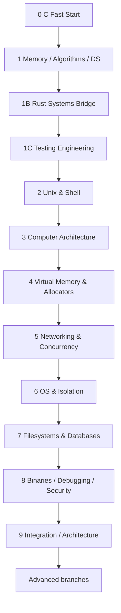

# Systems Engineering Roadmap

Краткая карта. **Исполняемый курс находится в [`course/README.md`](course/README.md).** Этот файл не дублирует lesson-level syllabus.

## Цель

Получить цельную инженерную модель:

```text
source code
→ algorithms / data structures / testing
→ memory / ownership
→ compiler / ABI / machine code
→ process / OS
→ network / concurrency
→ storage / database
→ binary / debugger / security
→ integrated service / architecture
```

Темп: **6–8 часов в неделю**.

## Core path



Текстовая версия той же цепочки есть в `course/README.md`; Mermaid не обязателен для mobile navigation.

## Core projects

- MiniKV v0;
- Vector in C;
- Hash Table in C;
- Rust MiniKV bridge;
- Unix Shell;
- Tiny16 assembler + emulator;
- Arena Allocator;
- Concurrent KV Server;
- Modern Linux Isolation Lab;
- SimpleDB;
- `minidbg-c`;
- Persistent KV Service capstone.

## CS fundamentals

Курс больше не ограничивается обзорным Big-O блоком. В core входят:

- asymptotic analysis, invariants, binary search;
- insertion/selection/merge/quick/heap sorting trade-offs;
- recursion/recurrence intuition;
- BST/traversals/balancing motivation;
- binary heap/Priority Queue;
- dynamic programming;
- string searching (naive, KMP intuition, Rabin–Karp);
- Trie;
- probability intuition для hashing;
- graphs/BFS/DFS/Dijkstra;
- IEEE 754 floating point;
- Unicode/UTF-8 boundary;
- testing engineering/fuzzing intuition;
- Boolean logic/CPU/ISA;
- compact P/NP/NP-complete/reduction intuition;
- scheduling/queueing/Little's Law;
- B+tree/fan-out/storage cost.

## C → Rust

Сначала вручную изучаются pointers, lifetime, ownership, `malloc/free`, UB и Hash Table. Затем Rust показывает, какие contracts compiler проверяет через ownership, borrowing, lifetimes, typed errors, safe abstractions и explicit `unsafe` boundaries.

Rust не дублирует каждый C-project.

## Source policy

Обязательная теория находится в репозитории. Внешние материалы — optional deep dive, текущая API/standard документация, альтернативное объяснение или дополнительный проект. Недоступность внешнего курса не блокирует core path.

## Advanced branches

После core выбирается направление:

- Security / Reverse Engineering / Binary Exploitation labs;
- Distributed Systems / Architecture;
- Kernel / OS;
- Rust Systems deeper;
- Compilers / Language Runtimes;
- Performance Engineering;
- Embedded / Hardware.

## Прогресс

[`SYSTEMS_ENGINEERING_PROGRESS.md`](SYSTEMS_ENGINEERING_PROGRESS.md)
