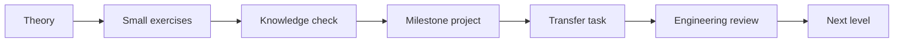
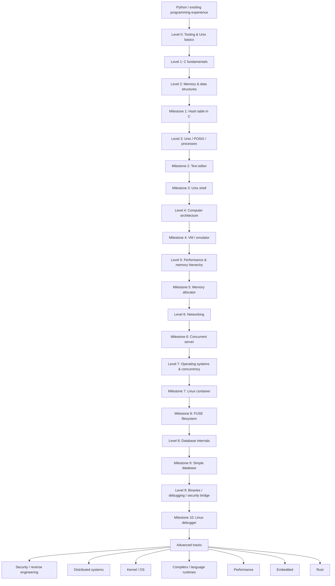
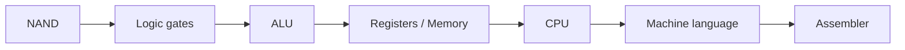
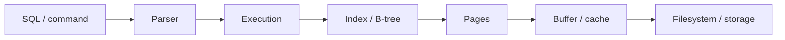
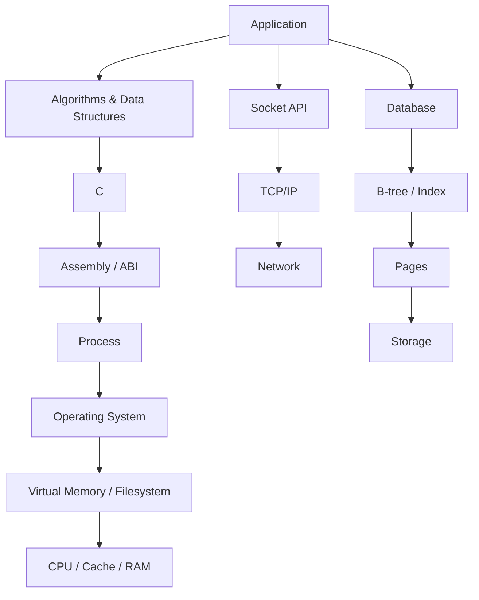

# Systems Engineering Roadmap

> Personal learning track built around the project milestones from this repository.
>
> **Goal:** move from Python/data work toward strong computer-science and systems-engineering fundamentals: C, algorithms, memory, computer architecture, Unix/POSIX, networking, operating systems, databases, binaries, debugging, security, distributed systems, and architecture.
>
> **Current pace:** 6–8 hours/week.
>
> **Learning mode:** mobile-first theory on Android + PC-first implementation. Project tutorials are milestones, not the curriculum itself.

---

## How to use this roadmap

Each level follows the same loop:

A milestone is **not complete** just because the tutorial works. Completion means:

1. I can explain the core concepts without copying definitions.
2. I can implement the guided project.
3. I can extend it with a new task not present in the tutorial.
4. I can discuss correctness, complexity, memory, performance, failure modes, security, testing, and trade-offs.

Use [`SYSTEMS_ENGINEERING_PROGRESS.md`](SYSTEMS_ENGINEERING_PROGRESS.md) to track progress.

---

# Big picture

---

# Study rhythm

At 6–8 h/week:

- **2.5–4 h/week — phone / metro:** videos, subtitles, HTML books, conceptual drills, short quizzes, occasional tiny C programs in Termux.
- **3–4 h/week — PC:** implementation, debugging, profiling, labs, milestone projects, transfer tasks.

Recommended mobile setup:

- Android + **Termux** (no alternative OS required)
- `clang`, `git`, `make`, editor, debugger where practical
- offline-downloaded lecture videos and HTML books

---

# Core resources

| Resource | Main role | Mobile/offline suitability |
|---|---|---|
| [CS50x](https://cs50.harvard.edu/x/) | C, memory, algorithms, data structures | Excellent; videos/subtitles downloadable |
| [Dive into Systems](https://diveintosystems.org/) | Main systems textbook, especially good for Python → C | Excellent HTML |
| [Beej's Guide to C](https://beej.us/guide/bgc/) | C reference / deeper explanations | Excellent HTML, downloadable |
| [MIT Missing Semester](https://missing.csail.mit.edu/) | Shell, Git, debugging, development tools | Excellent video/text |
| [MIT Mathematics for Computer Science](https://ocw.mit.edu/courses/6-042j-mathematics-for-computer-science-spring-2015/) | Discrete mathematics | Good video/offline |
| [MIT 6.006 Introduction to Algorithms](https://ocw.mit.edu/courses/6-006-introduction-to-algorithms-spring-2020/) | Algorithms & data structures | Good video/offline |
| [Nand2Tetris](https://www.nand2tetris.org/) | Computer architecture from first principles | Good for theory; projects on PC |
| [OSTEP](https://pages.cs.wisc.edu/~remzi/OSTEP/) | Operating systems | Better on larger screen, free |
| [Beej's Networking Concepts](https://beej.us/guide/bgnet0/) | Networking fundamentals | Excellent HTML/offline |
| [Beej's Network Programming](https://beej.us/guide/bgnet/) | Sockets and network programming | Excellent HTML/offline |
| [Crafting Interpreters](https://craftinginterpreters.com/) | Interpreters, VMs, runtimes | Excellent mobile HTML |

---

# Level 0 — Engineering environment

**Target:** understand how source code becomes a running process and become comfortable with the command line.

**Estimated time:** ~2 weeks.

## Learn

- terminal vs shell
- filesystem, paths, permissions
- stdin / stdout / stderr
- pipes and redirection
- source → compiler → object file → linker → executable
- exit codes
- Git basics
- Make basics
- debugger basics

## Primary sources

- MIT Missing Semester: shell, command-line environment, tools, debugging, Git
- Dive into Systems: introductory compilation model as needed

## Practice

- compile a minimal C program manually
- compile with warnings enabled
- read command-line arguments
- read/write a file
- create a minimal Makefile
- inspect/debug a simple crash

## Gate

Be able to explain:

- source file vs object file vs executable
- compiler vs linker
- terminal vs shell
- program vs process
- what an exit code is

---

# Level 1 — C fundamentals

**Target:** learn C as a language without drowning in C++ or advanced systems concepts yet.

**Estimated time:** ~5–6 weeks.

## Learn

- primitive types and `sizeof`
- signed / unsigned integers
- operators and control flow
- functions and scope
- arrays and strings
- `struct`, `enum`
- headers and `.c` / `.h` separation
- preprocessor basics
- `argc` / `argv`
- basic file I/O

## Sources

1. **CS50x** — Week 1: C; Week 2: Arrays; selected Week 3 material
2. **Dive into Systems — Chapter 1**
3. **Beej's Guide to C** as reference
4. Optional short mobile drills: browser-based C exercises / compiler

## Parallel CS thread — Algorithms I

- linear search
- binary search
- elementary sorting
- recursion
- Big O / Ω / Θ intuition

## Parallel math thread — Discrete Math I

Selected MIT Mathematics for Computer Science topics:

- logic
- sets
- functions
- relations
- proof intuition
- induction
- sums and logarithms
- basic combinatorics

---

# Level 2 — Memory and data structures

**Target:** understand the biggest conceptual difference between Python and C: explicit memory and representation.

**Estimated time:** ~7–9 weeks.

## Learn

- byte and address
- pointers and dereferencing
- pointer arithmetic
- arrays vs pointers
- stack vs heap
- object lifetime
- `malloc`, `calloc`, `realloc`, `free`
- `NULL`
- dangling pointers
- memory leaks
- double free / use-after-free concepts
- buffer overflows
- linked structures

## Sources

1. CS50x Week 4 — Memory
2. CS50x Week 5 — Data Structures
3. Dive into Systems — Chapter 2
4. Beej's Guide to C — matching sections

## Algorithms / DS II

Implement and understand:

- dynamic array
- linked list
- stack
- queue
- hash table
- binary search tree

---

# Milestone 1 — Hash Table in C

Repository tutorial: [Write a hash table in C](https://github.com/jamesroutley/write-a-hash-table)

## Concepts reinforced

- structs
- pointers
- arrays
- strings
- manual allocation
- hashing
- collision handling
- time complexity

## Transfer task ideas

- add automatic resizing
- expose configurable load factor
- collect collision statistics
- implement a second collision strategy and compare

## Must explain after completion

- why average lookup can be O(1)
- why worst-case lookup can become O(n)
- what load factor means
- why resizing is expensive
- where allocation occurs
- who owns and frees each allocation

---

# Level 3 — Unix / POSIX and processes

**Target:** understand how C programs interact with the operating system.

**Estimated time:** ~6 weeks.

## Learn

- kernel vs user space
- system calls
- file descriptors
- `open`, `read`, `write`, `close`
- processes and PIDs
- `fork`, `exec`, `wait`
- environment variables
- pipes
- signals
- terminal / TTY basics

## Sources

- Dive into Systems — relevant OS / Unix sections
- OSTEP — Processes, Process API, Address Spaces (selected)
- man pages as primary API documentation

---

# Milestone 2 — Text Editor

Repository tutorial: [Build Your Own Text Editor](http://viewsourcecode.org/snaptoken/kilo/)

## Reinforces

- terminal I/O
- raw mode
- buffers
- files
- strings and memory
- escape sequences

## Transfer task ideas

- line numbers
- simple search
- status bar information
- syntax-highlight subset

---

# Milestone 3 — Unix Shell

Repository tutorial: [Write a Shell in C](https://brennan.io/2015/01/16/write-a-shell-in-c/)

**Core milestone — do not skip.**

## Reinforces

- process lifecycle
- parsing
- `fork` / `exec` / `wait`
- file descriptors
- pipes
- environment

## Transfer task ideas

- pipelines `A | B`
- redirection `>` / `<`
- built-in `cd`
- environment variable expansion

---

# Level 4 — Computer architecture

**Target:** understand what exists below C.

**Estimated time:** ~8–10 weeks.

## Learn

- binary and hexadecimal
- bits and bitwise operations
- integer representation
- endianness
- CPU basics
- registers
- instructions and machine code
- program counter / instruction pointer
- stack pointer
- calls, returns, stack frames
- calling conventions
- memory hierarchy introduction

## Sources

### Dive into Systems

Use the chapters on:

- data representation
- assembly
- architecture
- memory hierarchy

### Nand2Tetris — Projects 1–6

1. Boolean Logic
2. Boolean Arithmetic
3. Memory
4. Machine Language
5. Computer Architecture
6. Assembler

These projects create the chain:

---

# Milestone 4 — Virtual Machine / Emulator

Choose one initially:

- [Write Your Own Virtual Machine](https://justinmeiners.github.io/lc3-vm/)
- [Building a CHIP-8 Emulator](https://austinmorlan.com/posts/chip8_emulator/)

## Reinforces

- registers
- opcodes
- program counter
- memory
- fetch → decode → execute

---

# Level 5 — Performance and memory hierarchy

**Target:** connect algorithmic complexity to actual hardware behavior.

**Estimated time:** ~4 weeks.

## Learn

- registers
- L1 / L2 / L3 cache
- RAM
- cache lines
- locality
- cache hit / miss
- contiguous memory
- branch behavior basics
- why equal-Big-O algorithms may perform very differently

## Source

- Dive into Systems — memory hierarchy / performance chapters

## Practical bridge

Relate these concepts back to Python/NumPy:

- contiguous arrays
- vectorization
- access patterns
- why Python loops and NumPy kernels behave differently

---

# Milestone 5 — Memory Allocator

Repository tutorial: [Memory Allocators 101](https://arjunsreedharan.org/post/148675821737/memory-allocators-101-write-a-simple-memory)

## Reinforces

- heap management
- allocator metadata
- free lists
- alignment
- fragmentation
- allocation policy

## Transfer task ideas

- add coalescing
- add statistics
- compare first-fit vs another policy

---

# Level 6 — Networking

**Target:** understand networking below HTTP libraries.

**Estimated time:** ~7–9 weeks.

## Learn

- Ethernet
- MAC addresses
- ARP
- IPv4
- subnetting
- routing
- ICMP
- UDP
- TCP
- ports
- DNS basics
- socket API
- byte order
- client/server architecture

## Sources

1. Beej's Networking Concepts
2. Beej's Network Programming
3. Wireshark experiments alongside theory

## Small projects

- TCP echo server/client
- minimal HTTP-like server
- multi-client server

---

# Milestone 6 — Concurrent Server

Repository series: **Programming concurrent servers**.

## Learn / reinforce

- threads
- blocking vs non-blocking I/O
- event-driven design
- event loops
- concurrency trade-offs

## Algorithms III — MIT 6.006 selections

Add as needed:

- hashing deeper
- balanced trees
- heaps
- BFS / DFS
- shortest paths
- dynamic programming

---

# Level 7 — Operating systems and concurrency

**Target:** build a coherent model of processes, memory, scheduling, synchronization, and persistence.

**Estimated time:** ~8 weeks.

## Learn

- processes and threads
- context switching
- scheduling
- virtual memory
- pages and page tables
- TLB
- IPC
- race conditions
- mutexes
- semaphores
- condition variables
- deadlocks
- devices and I/O
- filesystem concepts

## Sources

1. Dive into Systems — OS / parallelism chapters
2. OSTEP — selected chapters from:
   - Virtualization
   - Concurrency
   - Persistence

---

# Milestone 7 — Linux Container

Repository tutorial: **Linux Container in 500 Lines of Code**.

## Reinforces

- processes
- namespaces
- isolation
- filesystem / mount behavior
- Linux internals

---

# Milestone 8 — FUSE Filesystem

Repository tutorial: **Write a FUSE Filesystem**.

## Reinforces

- filesystem abstractions
- path lookup
- metadata
- file operations
- user/kernel boundary

---

# Level 8 — Database internals

**Target:** stop treating a database as a black-box SQL endpoint.

**Estimated time:** ~5–7 weeks.

## Learn

- storage characteristics
- pages
- records
- serialization
- B-trees
- indexes
- buffer/cache concepts
- query execution basics
- transactions conceptually
- WAL conceptually

---

# Milestone 9 — Simple Database

Repository tutorial: [Let's Build a Simple Database](https://cstack.github.io/db_tutorial/)

## Desired mental model

## Transfer task ideas

- add a new command
- add a simple secondary index
- instrument page reads/writes
- document failure/recovery limitations

---

# Level 9 — Binaries, debugging, and security bridge

**Target:** understand executable programs as binary structures and running machine state.

**Estimated time:** ~6–8 weeks.

## Learn

- ELF basics
- sections / symbols
- debug information
- registers
- breakpoints
- signals
- stack frames
- calling conventions
- process memory
- memory corruption concepts

---

# Milestone 10 — Linux Debugger

Repository series: **Writing a Linux Debugger**.

Topics include:

- breakpoints
- registers and memory
- ELF / DWARF
- signals
- stepping
- source-level breakpoints
- stack unwinding
- variables

This milestone is the bridge into:

- reverse engineering
- binary exploitation
- malware analysis
- OS security

---

# Core-track completion criteria

The core track is complete when I can reason through this vertical stack:

The goal is not mastery of every layer; it is enough depth to understand interfaces, costs, failure modes, and architecture trade-offs.

---

# Advanced tracks

After the core, stop following one linear route. Choose according to goals and projects.

## A. Security / Reverse Engineering

- x86-64 deeper
- ELF deeper
- Ghidra
- reverse engineering
- memory corruption
- exploitation fundamentals
- OS security

Suggested repository milestones:

- Linux debugger extensions
- compiler / VM projects
- OS / kernel work

## B. Distributed Systems

- replication
- partitioning
- consistency models
- consensus
- failure detection
- queues
- distributed storage
- observability and reliability

This is the main bridge from **systems engineer** to **system architect**.

## C. Kernel / OS

- bootloader
- interrupts
- scheduler
- memory manager
- filesystems
- drivers

Repository options:

- Write a Bootloader in C
- Let's Write a Kernel
- Write an OS from Scratch

## D. Compilers / Language Runtimes

- lexer
- parser
- AST
- bytecode
- VM
- code generation
- garbage collection

Primary source:

- Crafting Interpreters

Repository milestones:

- Build an Interpreter
- Write a C Compiler

## E. Performance Engineering

- profiling
- cache behavior
- SIMD fundamentals
- parallelism
- synchronization overhead
- memory layout

Repository milestone:

- High-Performance Matrix Multiplication

## F. Embedded / Hardware

- microcontrollers
- GPIO
- interrupts
- UART
- SPI
- I²C
- RTOS fundamentals

This track connects naturally with security hardware / pentesting devices.

## G. Rust

Rust comes **after enough C to understand why ownership exists**.

Suggested method:

1. Learn ownership / borrowing / lifetimes.
2. Reimplement one earlier C milestone in Rust.
3. Compare memory model and failure modes explicitly.

Good candidates:

- hash table
- TCP server
- VM

---

# AI usage policy for this track

AI is allowed for:

- concept explanations
- documentation lookup
- debugging guidance
- compiler-error interpretation
- code review
- architecture discussion
- testing ideas

AI should **not** replace the learning milestone by writing the whole solution.

Preferred debugging request:

> "Here is my code and the failure. Help me identify the likely cause and give me the next diagnostic step, but do not rewrite the solution for me."

---

# Approximate first 4–5 months

| Weeks | Focus |
|---|---|
| 1–2 | Environment, shell, compiler, Git, debugger basics |
| 3–5 | C fundamentals |
| 6–7 | Arrays, strings, compilation model |
| 8–9 | Algorithms basics + complexity |
| 10–13 | Pointers, stack, heap |
| 14–16 | Dynamic memory + linked structures |
| 17–19 | **Milestone 1 — Hash Table in C** |

Discrete mathematics runs in small parallel blocks throughout.

---

# Roadmap maintenance rules

This roadmap is expected to change.

Update it when:

- a milestone turns out to require missing prerequisites;
- a source is outdated, inaccessible, or poor on mobile;
- a concept proves already mastered and can be compressed;
- a new engineering/security goal changes priorities;
- a completed project exposes an important knowledge gap;
- weekly capacity changes materially.

When changing the roadmap:

1. Record the reason in the progress log.
2. Prefer changing prerequisites/order over merely adding more material.
3. Keep milestones tied to concepts they validate.
4. Avoid collecting resources without a clear role.
5. Keep the **core** finite; move optional depth to Advanced Tracks.

---

# Next action

Start with **Level 0 — Engineering environment**.

The first learning objective is:

> Understand the complete path from a C source file to a running process, and be able to compile and inspect a minimal program manually on both the main computer and Android/Termux.
