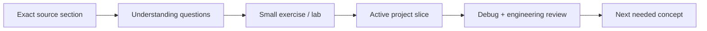
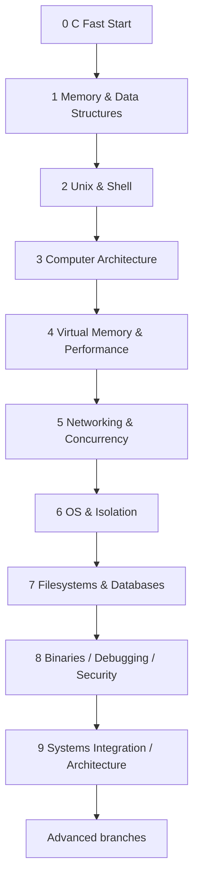

# Systems Engineering Course

> Canonical learning path for this fork.
>
> **Audience:** programmer with existing Python experience and little/no C or low-level background.  
> **Pace:** 6–8 hours/week.  
> **Mode:** mobile-first theory + PC-first implementation.  
> **Expected core duration:** roughly 15–20 months including consolidation buffers.

This repository is no longer just a roadmap. The `course/` directory is an instructor-led, project-first curriculum with prerequisites, source roles, labs, milestones, rubrics and exit gates.

---

# Start here

Before Module 0 read:

1. [`ENVIRONMENT.md`](ENVIRONMENT.md) — canonical Windows/WSL2/Linux toolchain and Android role.
2. [`ASSESSMENT_AND_STUDY_RULES.md`](ASSESSMENT_AND_STUDY_RULES.md) — lesson cycle, module gates, AI policy, workload and evidence.
3. [`AUDIT_2026-08.md`](AUDIT_2026-08.md) — why the course is structured this way and which hidden prerequisites/outdated tutorials were corrected.

Russian alternatives/companions are tracked in:

- [`../SYSTEMS_ENGINEERING_RUSSIAN_RESOURCES.md`](../SYSTEMS_ENGINEERING_RUSSIAN_RESOURCES.md)

Progress is tracked in:

- [`../SYSTEMS_ENGINEERING_PROGRESS.md`](../SYSTEMS_ENGINEERING_PROGRESS.md)

---

# Learning model

A lesson is not "read chapter 3 and come back".

The operating loop is:



Rules:

- learn only enough theory for the next meaningful step;
- use normally **one teaching source + one optional reference**;
- maintain **one large core milestone at a time** where practical;
- project code is written by the learner;
- AI gives explanations/review/debugging hints, not whole milestone solutions;
- old tutorials are references when their API/environment is outdated;
- a milestone is complete only after a transfer task and engineering review.

---

# Course map



---

# Core modules

## Module 0 — C Fast Start

**File:** [`00-c-fast-start/README.md`](00-c-fast-start/README.md)  
**Time:** ~10–15 h  
**Outcome:** become syntactically functional in C without repeating a beginner programming semester.  
**Project:** `MiniKV v0` — fixed-array key/value store with linear lookup.

Main topics:

- compile/run/debug basics;
- types / `sizeof`;
- functions / control flow;
- arrays / C strings;
- structs / simple modules;
- linear search / first complexity intuition.

---

## Module 1 — Memory, Pointers, and Data Structures

**File:** [`01-memory-data-structures/README.md`](01-memory-data-structures/README.md)  
**Time:** ~55–70 h  
**Core milestone:** Hash Table in C  
**Mini-milestone:** Dynamic Array / Vector.

Main topics:

- pointers / ownership / lifetime;
- stack vs heap;
- `malloc/calloc/realloc/free`;
- undefined behavior / sanitizers / GDB;
- arrays vs linked structures;
- Big-O/Θ, search/sort, recursion;
- BST/heap concepts;
- dynamic-programming fundamentals;
- hashing/collisions/load factor/rehash.

---

## Module 2 — Unix, Processes, and the Shell

**File:** [`02-unix-shell/README.md`](02-unix-shell/README.md)  
**Time:** ~40–55 h  
**Core milestone:** Unix Shell in C  
**Guided lab:** only selected Kilo terminal/raw-mode work.

Main topics:

- file descriptors;
- robust short read/write handling;
- `errno` / `strace`;
- `fork/exec/waitpid`;
- `dup2` / redirection;
- pipes and descriptor topology;
- signals;
- terminal/`termios`.

The course shell has an explicit limited grammar. It is not presented as a POSIX-complete shell.

---

## Module 3 — Computer Architecture and Machine Code

**File:** [`03-computer-architecture/README.md`](03-computer-architecture/README.md)  
**Time:** ~50–65 h  
**Core milestone:** Nand2Tetris Projects 1–6 + small VM/emulator.

Main topics:

- binary/hex/two's complement;
- gates / ALU / state / RAM;
- CPU / program counter;
- machine code / assembly;
- assembler;
- x86-64 bridge;
- stack frames / ABI basics;
- fetch/decode/execute.

---

## Module 4 — Virtual Memory, Performance, and Allocators

**File:** [`04-virtual-memory-performance-allocator/README.md`](04-virtual-memory-performance-allocator/README.md)  
**Time:** ~35–50 h  
**Core milestone:** Arena Allocator.

Main topics:

- virtual addresses / pages / page faults / TLB;
- `mmap`;
- cache lines / locality / working sets;
- measurement methodology;
- alignment / allocator metadata;
- free lists;
- fragmentation;
- split/coalesce;
- policy comparison.

`Memory Allocators 101` is a **historical reference** because its `sbrk()` backend is not the modern course recommendation.

---

## Module 5 — Networking and Concurrency

**File:** [`05-networking-concurrency/README.md`](05-networking-concurrency/README.md)  
**Time:** ~55–70 h  
**Core milestone:** Concurrent TCP KV Server.

Main topics:

- Ethernet / ARP / IPv4 / routing;
- TCP / UDP;
- socket API / `getaddrinfo`;
- TCP stream framing;
- partial send/recv;
- threads / races / mutexes / condition variables;
- bounded queues / backpressure;
- event-loop/`poll` model;
- throughput and p50/p95/p99 latency;
- graphs / BFS / DFS / Dijkstra checkpoint.

---

## Module 6 — Operating Systems and Isolation

**File:** [`06-os-isolation/README.md`](06-os-isolation/README.md)  
**Time:** ~40–55 h  
**Core milestone:** Modern Linux mini-container / isolation lab.

Main topics:

- scheduling and context switching;
- VM deeper / copy-on-write;
- synchronization / deadlocks;
- IPC;
- `/proc` process inspection;
- Linux namespaces;
- cgroup v2;
- capabilities/security-boundary limitations.

The old `Linux Container in 500 Lines of Code` is **historical reference**, not a 2026 implementation spec.

---

## Module 7 — Filesystems and Database Internals

**File:** [`07-filesystems-databases/README.md`](07-filesystems-databases/README.md)  
**Time:** ~60–80 h  
**Core milestone:** Simple Database in C  
**Guided lab:** current libfuse 3 examples.

Main topics:

- pathnames / inodes / links;
- page cache / durability / `fsync` concept;
- libfuse 3 callback model;
- storage pages / records / serialization;
- B-tree/page-index reasoning;
- page access instrumentation;
- transactions / WAL / isolation conceptually.

The cstack database milestone does **not** pretend to implement a complete transactional/WAL database.

---

## Module 8 — Binaries, Debugging, and Security Bridge

**File:** [`08-binaries-debugging-security/README.md`](08-binaries-debugging-security/README.md)  
**Time:** ~40–55 h  
**Core milestone:** Minimal Linux Debugger in C.

Main topics:

- ELF;
- symbols / debug information;
- process memory;
- PIE / ASLR;
- `ptrace`;
- registers / memory;
- x86 `int3` software breakpoints;
- single-step;
- NX / canaries / RELRO concepts;
- controlled local memory-corruption diagnostics.

The Sy Brand C++ debugger series is a **concept/reference source**; C++ is not a hidden core prerequisite.

---

## Module 9 — Systems Integration and Architecture Capstone

**File:** [`09-systems-integration-architecture/README.md`](09-systems-integration-architecture/README.md)  
**Time:** ~40–55 h  
**Core capstone:** observable persistent KV service.

Main topics:

- requirements and component boundaries;
- service protocol;
- latency / throughput / saturation;
- Little's Law `L = λW`;
- backpressure / overload;
- graceful shutdown / recovery;
- observability;
- SLI/SLO introduction;
- failure injection;
- ADRs;
- capacity/scaling analysis.

This module deliberately asks "what actually bottlenecks/fails?" before introducing distributed-systems buzzwords.

---

# Where the CS foundation lives

The course does not run separate disconnected semesters for every CS subject, but coverage is mandatory.

| CS area | Main location |
|---|---|
| C / software construction | Modules 0–2 |
| Algorithms / data structures | Modules 1 and 5 |
| Discrete reasoning / math | just-in-time in Modules 1, 3, 5, 9 |
| Computer architecture | Module 3 |
| Virtual memory / performance | Modules 4 and 6 |
| Operating systems | Modules 2 and 6 |
| Networking | Module 5 |
| Concurrency | Modules 5–6 |
| Filesystems / storage | Module 7 |
| Database internals | Module 7 |
| Binaries / debugging / security | Module 8 |
| Architecture / operability | every engineering review + Module 9 |

This prevents both extremes:

- "just code projects without fundamentals";
- "finish five theory courses before building anything".

---

# Project classification

Not every upstream tutorial has equal status.

## Core milestones

Required integration projects:

- Hash Table;
- Unix Shell;
- small VM/emulator;
- Arena Allocator;
- Concurrent KV Server;
- modern isolation lab;
- Simple Database;
- Minimal Debugger in C;
- Systems Architecture Capstone.

## Guided labs

Only selected learning slices are required:

- Kilo terminal/raw-mode;
- libfuse 3 `hello`/`passthrough` adaptation;
- selected tool experiments.

## Stretch / historical references

Useful but not core requirements:

- full Kilo editor;
- full custom FUSE filesystem;
- old container walkthrough as-is;
- C++/libelfin full debugger tutorial;
- advanced transactional DB features not implemented by the chosen milestone.

---

# How an instructor-led lesson is created

The module README is the specification. A lesson should assign **exact sections**, not say "go learn C/OSTEP".

Example structure:

```text
Goal: understand pointer parameters

Phone:
- exact Dive Into Systems section
- optional Russian explanation

Check:
- 3 causal questions

PC exercise:
- one focused pointer task

Project:
- change current MiniKV API to operate on Store*

Review:
- draw ownership/lifetime
- explain one failure mode
```

The repository stores durable structure and progress; the instructor/chat adapts lesson granularity to actual understanding.

---

# Advanced branches after the finite core

Choose after Module 9 according to goals.

## Security / Reverse Engineering

- deeper x86-64;
- Ghidra;
- binary exploitation in legal/local labs;
- OS/embedded security;
- malware analysis.

## Distributed Systems / Architecture

- replication;
- partitioning/sharding;
- consistency models;
- consensus;
- retries/idempotency deeper;
- queues/streams;
- distributed storage;
- reliability/observability deeper.

## Kernel / OS

- bootloader;
- interrupts;
- scheduler;
- memory manager;
- drivers.

## Rust

Reimplement a previous C project and compare ownership/failure models.

## Compilers / Runtimes

- Crafting Interpreters;
- compiler/VM/GC work.

## Embedded

- microcontrollers;
- GPIO;
- UART/SPI/I²C;
- interrupts;
- RTOS.

---

# Immediate next action

Start with [`00-c-fast-start/README.md`](00-c-fast-start/README.md).

Do not pre-study later modules. The instructor should issue the first exact source assignment and exercise from Unit 0.1.