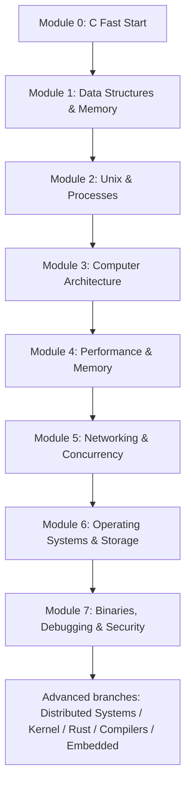

# Systems Engineering Course

> This is the **canonical learning path** for this fork.
>
> The old roadmap describes the full landscape. This course turns that landscape into a simple sequence that can actually be followed week by week.

## Course goal

Build a strong computer-science and systems-engineering foundation starting from an existing Python background and ending with the ability to reason about software across layers: data structures, memory, CPU, operating systems, networks, storage, binaries, performance, security, and architecture.

**Pace:** 6–8 hours/week.

**Mode:** mobile-first theory + PC-first project work.

---

# The simple learning rule

Every module follows the same pattern:

```text
learn just enough theory
        ↓
small exercises
        ↓
apply it immediately in the active project
        ↓
learn the next concept when the project needs it
        ↓
expand the same project
        ↓
review the design and trade-offs
```

The course is **project-first**, not exercise-first.

Exercises exist to learn one concept. Projects exist to learn engineering.

---

# Source policy

At any moment there should normally be only:

1. **one primary teaching source**;
2. **one optional reference / Russian companion**;
3. the **active project**.

Do not study five courses in parallel.

Russian materials are preferred when quality is comparable. English primary material is kept when it is clearly stronger, more current, or uniquely suited to the project.

See [`../SYSTEMS_ENGINEERING_RUSSIAN_RESOURCES.md`](../SYSTEMS_ENGINEERING_RUSSIAN_RESOURCES.md) for Russian alternatives.

---

# Course map



---

# Module 0 — C Fast Start

**Goal:** learn enough C to start building real software quickly.

**Expected time:** ~2–4 weeks.

## Primary source

**Russian-first option:** translated CS50 C material (Vert Dider / JavaRush), selectively.

**Current reference:** modern CS50 C pages + Beej's Guide to C as lookup material.

Do not complete CS50 as a separate course.

## Learn

- compile and run a C program
- primitive types and `sizeof`
- operators and control flow
- functions
- arrays
- strings
- `struct`
- basic `.c` / `.h`
- compiler warnings
- very basic Git workflow

## Exercises

Short exercises only. The purpose is syntax fluency, not completion badges.

Recommended mobile exercise bank: Stepik C.

## Active project begins immediately

### Project A — Hash Table in C

Start with a deliberately primitive version:

1. project skeleton;
2. fixed array of key/value entries;
3. linear lookup;
4. explicit `Entry` / `Table` structs.

Do **not** wait until pointers and hashing are fully learned before starting the project.

## CS concepts introduced

- what compilation is
- representation of values
- arrays as contiguous data
- linear search
- first Big-O intuition: why linear lookup becomes a problem

## Module exit condition

You can write small C programs without constantly translating Python syntax and can explain why fixed arrays and C strings behave differently from Python containers/strings.

---

# Module 1 — Data Structures, Pointers, and Memory

**Goal:** learn the low-level concepts that make C valuable for systems work.

**Expected time:** ~8–12 weeks.

## Primary source

**Dive into Systems**, selected C/memory chapters.

## Russian companion / exercises

- Stepik C exercises
- CSC / Stepik Algorithms & Data Structures, selected modules

## Learn in project order

### Block 1 — pointers

- addresses
- `&` and `*`
- pointer types
- passing pointers to functions
- arrays vs pointers
- pointer arithmetic

**Project A expansion:** change APIs to operate on table pointers; reason about object lifetime.

### Block 2 — stack and heap

- local lifetime
- stack vs heap
- `malloc`, `calloc`, `realloc`, `free`
- ownership
- leaks
- dangling pointers
- double-free / use-after-free concepts

**Project A expansion:** dynamically allocate the table and entries; implement cleanup paths.

### Block 3 — data structures

- dynamic array
- linked list
- stack
- queue
- hash table
- binary search tree basics

### Mini-project — Dynamic Array / Vector in C

Build:

- create/free
- get/set
- push
- capacity growth

### Block 4 — algorithms and math just in time

- Big O / Θ intuition
- binary search
- elementary sorting
- amortized growth intuition
- logarithms where needed
- modulo arithmetic for hashing
- probability intuition for collisions

### Project A completion — Hash Table in C

Add:

- hash function
- buckets
- collision handling
- load factor
- resize / rehash
- tests
- transfer feature not in tutorial

## Engineering review

Explain:

- average vs worst-case lookup
- ownership of every allocation
- load factor
- resize cost
- failure paths
- API design
- what changes at 10x / 100x size

---

# Module 2 — Unix, Processes, and the Shell

**Goal:** understand how programs interact with the operating system.

**Expected time:** ~6–8 weeks.

## Primary source

**Dive into Systems / selected Unix-OS sections**, supported by selected OSTEP process chapters.

## Russian companion

Russian Missing Semester translation for shell/tooling concepts.

## Learn in project order

- files and file descriptors
- `open/read/write/close`
- kernel vs user space
- syscall idea
- process / PID
- `fork`
- `exec`
- `wait`
- environment variables
- pipes
- redirection
- signals
- terminal / TTY basics

## Project B — Text Editor

Use the repository's **Build Your Own Text Editor** tutorial incrementally:

- terminal I/O
- raw mode
- editable buffer
- file load/save
- cursor/status
- transfer feature

## Project C — Unix Shell

Core project; do not skip.

Progression:

1. parse a command;
2. launch one process;
3. `fork/exec/wait`;
4. built-in `cd`;
5. redirection;
6. pipelines;
7. signals/environment as extensions.

## CS concepts introduced

- process model
- isolation
- OS interfaces
- resource handles
- composition via pipes

---

# Module 3 — Computer Architecture and Assembly

**Goal:** understand what C eventually turns into and how a CPU executes programs.

**Expected time:** ~8–10 weeks.

## Primary source

**Nand2Tetris Projects 1–6**.

## Reference

Dive into Systems architecture/assembly chapters.

## Learn

- binary and hexadecimal
- signed integers
- bitwise operations
- logic gates
- ALU
- registers
- RAM
- CPU
- machine instructions
- program counter
- machine code
- assembly
- stack pointer
- calls/returns
- stack frames
- calling conventions / ABI basics

## Projects

### Nand2Tetris 1–6

Build the chain:

```text
NAND -> gates -> ALU -> memory -> CPU -> machine language -> assembler
```

### Project D — VM or CHIP-8 Emulator

Build incrementally:

- machine state
- memory
- registers
- program counter
- decode instructions
- execute instructions
- control flow / I/O

## CS concepts introduced

This entire module **is** the computer-architecture CS block.

---

# Module 4 — Performance and Memory Hierarchy

**Goal:** connect algorithmic complexity with actual hardware performance.

**Expected time:** ~4–6 weeks.

## Primary source

**Dive into Systems — memory hierarchy / performance chapters.**

## Learn

- registers
- L1/L2/L3 cache
- RAM
- cache lines
- spatial / temporal locality
- contiguous vs pointer-heavy data
- cache hit/miss
- basic profiling
- branch behavior intuition

## Bridge to existing Python/NumPy experience

Understand why:

- contiguous arrays matter;
- vectorized NumPy operations are fast;
- two O(n) algorithms can perform differently;
- memory layout is an architectural decision.

## Project E — Memory Allocator

Build incrementally:

- simple bump allocator idea
- block metadata
- free list
- reuse
- splitting / coalescing
- fragmentation statistics
- compare allocation policies

---

# Module 5 — Networking and Concurrency

**Goal:** understand networking below HTTP libraries and learn the first concurrency models.

**Expected time:** ~8–10 weeks.

## Primary source

**Russian primary for networking theory:** Stepik — Основы компьютерных сетей.

## Programming reference

**Beej's Guide to Network Programming.**

## Learn

- Ethernet
- MAC / ARP
- IPv4
- subnetting
- routing
- ICMP
- UDP
- TCP
- ports
- DNS basics
- byte order
- sockets

## Small project progression

1. TCP echo client/server
2. simple custom protocol
3. minimal HTTP-like server
4. multiple clients

## Concurrency block

- blocking vs non-blocking
- threads
- race condition intuition
- event-driven I/O
- event loops

## Project F — Concurrent Server

Compare at least two designs:

- thread-per-client
- event-driven / non-blocking

## Algorithms inserted when useful

Selected MIT 6.006 / CSC topics only when the projects need them:

- heaps
- trees
- BFS / DFS
- shortest paths
- dynamic programming basics

No detached algorithms semester is required before continuing.

---

# Module 6 — Operating Systems and Storage

**Goal:** understand scheduling, virtual memory, synchronization, filesystems, and persistent data.

**Expected time:** ~10–14 weeks.

## Primary source

**OSTEP**, selected chapters.

## Russian companion

Stepik Operating Systems for stable concepts / alternate explanations.

## Learn

- process vs thread
- context switch
- scheduling
- virtual memory
- pages / page tables
- TLB
- IPC
- mutexes
- semaphores
- condition variables
- deadlocks
- devices / I/O
- filesystem concepts

## Project G — Linux Container

Use namespaces/isolation to make OS abstractions concrete.

## Project H — FUSE Filesystem

Use filesystem callbacks, path lookup, metadata, file operations, and persistence.

## Storage / database block

Learn:

- pages
- records
- serialization
- B-trees
- indexes
- buffer/cache concepts
- transactions
- WAL / recovery intuition

## Project I — Simple Database

Progression:

- command parser / REPL
- rows
- pages
- table scan
- B-tree/index
- page splits
- persistence
- transfer feature

---

# Module 7 — Binaries, Debugging, and Security Bridge

**Goal:** understand executable files and running programs as inspectable machine state.

**Expected time:** ~6–8 weeks.

## Primary source

The repository's **Writing a Linux Debugger** series, with targeted reference material as required.

## Learn

- ELF basics
- sections / symbols
- debug information
- process memory
- registers
- breakpoints
- signals
- stack frames
- calling convention deeper
- memory corruption concepts

## Project J — Linux Debugger

Build:

- attach/control process
- breakpoints
- inspect registers/memory
- ELF/DWARF support
- stepping
- stack unwinding
- variable inspection

## Security bridge

After this module, the foundations are sufficient to branch into:

- reverse engineering
- binary exploitation in legal/local labs
- OS security
- malware analysis

---

# What is NOT a separate course anymore

The following topics are still mandatory, but are integrated where they matter:

| Topic | Where it is learned |
|---|---|
| Algorithms / Big O | Modules 1 and 5, then as needed |
| Data structures | Module 1 |
| Discrete math | Just-in-time inside algorithms, hashing, graphs, correctness |
| Computer architecture | Module 3 |
| Operating systems | Modules 2 and 6 |
| Concurrency | Modules 5 and 6 |
| Networking | Module 5 |
| Database internals | Module 6 |
| Security fundamentals | Module 7 |
| System design / architecture thinking | engineering review after every project |

This keeps the curriculum coherent without removing the CS foundation.

---

# Lesson format

A normal lesson/session is deliberately simple.

## 1. One concept

10–30 minutes of explanation / assigned video or reading.

Examples:

- what a pointer stores
- what `fork()` creates
- what a cache line is

## 2. Check understanding

A few questions. If the concept is not clear, do not continue.

## 3. Small exercise

Usually 10–30 minutes. One focused skill.

## 4. Project slice

Use the new concept in the current milestone project.

This is usually the largest and most important part of a PC session.

## 5. Review

Explain:

- what changed;
- why it works;
- what could fail;
- what the cost/trade-off is.

Then the next lesson begins from the next obstacle in the project.

---

# Mobile vs PC

## Phone / metro

Best for:

- CS50 RU / other video lectures
- Stepik exercises and quizzes
- Russian Missing Semester notes
- Beej / Dive Into Systems HTML
- conceptual questions
- review

## PC

Best for:

- milestone code
- debugger
- compiler / sanitizers
- Wireshark
- tests
- profiling
- Git commits

---

# Advanced branches after the core

Do not choose now. Finish the core first, then prioritize based on career direction.

## Distributed Systems / Architecture

- replication
- consistency
- partitioning
- consensus
- retries / idempotency
- queues / streams
- distributed storage
- observability
- reliability
- system design case studies

## Kernel / OS

- bootloader
- interrupts
- scheduler
- memory manager
- drivers

## Rust

Reimplement an earlier C project in Rust and compare ownership/failure models.

## Compilers / Runtimes

Crafting Interpreters / compiler projects.

## Embedded

Microcontrollers, GPIO, interrupts, UART, SPI, I²C, RTOS.

## Security

Reverse engineering, binary exploitation labs, OS security, embedded security.

---

# Starting point

Start with **Module 0 — C Fast Start**.

Do not study weeks of shell/tooling first.

The first objective is simply:

> compile a small C program, understand the minimum syntax, and start the Hash Table project as soon as arrays and structs are available.
